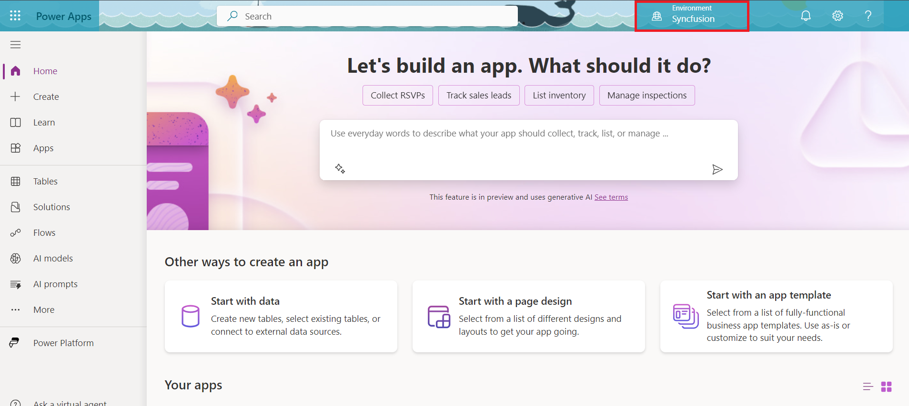
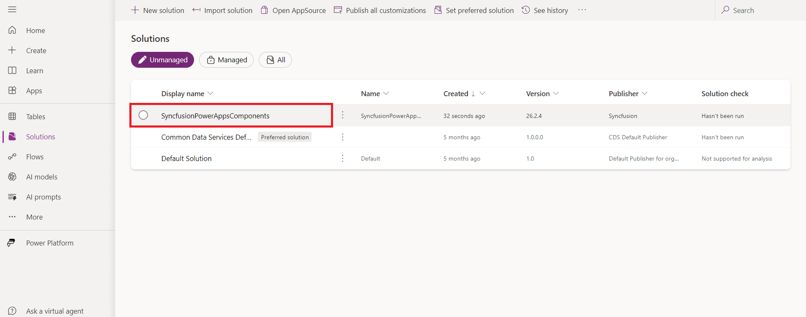

# Syncfusion PowerApps Code Components

The **Syncfusion PowerApps Code Components** library provides a modern, efficient, and user-friendly suite of components tailored for PowerApps. Built on the [PowerApps Component Framework (PCF)](https://learn.microsoft.com/en-us/power-apps/developer/component-framework/overview), these components seamlessly integrate with Canvas apps, Model-driven apps, and Power Pages (Portals). It offers a rich set of features and functionalities that are essential for any business application, ensuring a streamlined development experience.

## Repository structure

The repository is organized into the following folders:

| Folders | Description |
| -------------------------- | ------------------------------------------------ |
| [`components`](components) | Contains the Syncfusion code components. |
| [`docs`](docs)             | Contains the documentation for Syncfusion code components. |
| [`gulp-tasks`](gulp-tasks) | Contains the gulp tasks for the Syncfusion code components library. |
| [`SyncfusionPowerAppsComponents`](SyncfusionPowerAppsComponents) | Contains the generated solution project and solution file with all Syncfusion code components in the **components** folder (Available after running the `npm run pack` command). |

## Components list

The Syncfusion PowerApps Code components library includes the following components, which can be used in supported PowerApps applications:

### Grids

| Code component | Documentation | Canvas Apps | Model-Driven Apps | Custom Pages | Power Pages |
|----------------|---------------|-------------|-------------------|--------------|-------------|
| [DataGrid](components/grids) `Preview` | 🔗 [link](./docs/grids/) | ✅ | ✅ | ✅ | ⬜ |
| [Pivot Table](components/pivotview) `Preview` | 🔗 [link](./docs/pivotview/) | ✅ | ✅ | ✅ | ✅ |
| [Spreadsheet](components/spreadsheet) `Preview` | 🔗 [link](./docs/spreadsheet/) | ✅ | ⬜ | ✅ | ⬜ |
| [Tree Grid](components/treegrid) `Preview` | 🔗 [link](./docs/treegrid/) | ✅ | ✅ | ✅ | ✅ |

### File Viewers & Editors

| Code component | Documentation | Canvas Apps | Model-Driven Apps | Custom Pages | Power Pages |
|----------------|---------------|-------------|-------------------|--------------|-------------|
| [PdfViewer](components/pdfviewer) `Preview` | 🔗 [link](./docs/pdfviewer/) | ✅ | ✅ | ✅ | ⬜ |
| [Rich Text Editor](components/richtexteditor) `Preview` | 🔗 [link](./docs/richtexteditor/) | ✅ | ✅ | ✅ | ⬜ |

### Data Visualization

| Code component | Documentation | Canvas Apps | Model-Driven Apps | Custom Pages | Power Pages |
|----------------|---------------|-------------|-------------------|--------------|-------------|
| [Chart](components/charts) `Preview` | 🔗 [link](./docs/charts/) | ✅ | ✅ | ✅ | ✅ |
| [Kanban](components/kanban) `Preview` | 🔗 [link](./docs/kanban/) | ✅ | ⬜ | ✅ | ⬜ |

### Calendars

| Code component | Documentation | Canvas Apps | Model-Driven Apps | Custom Pages | Power Pages |
|----------------|---------------|-------------|-------------------|--------------|-------------|
| [Schedule](components/schedule) `Preview` | 🔗 [link](./docs/schedule/) | ✅ | ✅ | ✅ | ✅ |
| [Gantt](components/gantt) `Preview` | 🔗 [link](./docs/gantt/) | ✅ | ✅ | ✅ | ✅ |

### Navigation

| Code component | Documentation | Canvas Apps | Model-Driven Apps | Custom Pages | Power Pages |
|----------------|---------------|-------------|-------------------|--------------|-------------|
| [FileManager](components/filemanager) `Preview` | 🔗 [link](./docs/filemanager/) | ✅ | ✅ | ✅ | ✅ |
| [Accordion](components/accordion) `Preview` | 🔗 [link](./docs/accordion/) | ✅ | ⬜ | ✅ | ⬜ |

_Anticipate future updates to the component list. \*_

## Install the prerequisites

Before starting with the Syncfusion PowerApps Code Components library, ensure the following prerequisites are installed:

- [node.js  (>= v18.20.4)](https://nodejs.org/en/download/) (LTS version is recommended)
- [.NET 6.x SDK](https://dotnet.microsoft.com/en-us/download/dotnet/6.0)
- [Microsoft Power Platform CLI](https://learn.microsoft.com/en-us/power-platform/developer/cli/introduction#install-microsoft-power-platform-cli)
- [System requirements for Syncfusion React components](https://ej2.syncfusion.com/react/documentation/system-requirement)

## Clone the repository

Clone the Syncfusion PowerApps components repository to your local machine.

## Creating the Syncfusion code components solution package

To generate a solution project and bundle all Syncfusion code components to create a solution package, follow these steps:

1. Open your command prompt and navigate to the [root folder](./) of this project.

    > [!IMPORTANT]
    > To avoid build failures, ensure that the entire folder path does not contain spaces. For example, instead of a path like **C:\Projects\My Project**, use `C:\Projects\MyProject` or `C:\Projects\My_Project`.

2. Execute the following commands to install dependencies

    ```bash
    npm install
    ```

3. Place the Syncfusion license key in the [`syncfusion-license.txt`](syncfusion-license.txt) file located in the project's root folder for registration.

    > [!NOTE]
    > A license banner will be visible if the application is run without a Syncfusion license key. To obtain your Syncfusion license key, visit the [Get license key](https://help.syncfusion.com/common/essential-studio/licensing/licensing-faq/where-can-i-get-a-license-key) page.

4. Execute the following command to create & pack the solution package:

    ```bash
    npm run pack
    ```

5. The resulting package will be created at [`SyncfusionPowerAppsComponents/bin/release/SyncfusionPowerAppsComponents.zip`](SyncfusionPowerAppsComponents/bin/release/SyncfusionPowerAppsComponents.zip), containing all Syncfusion code component.

## Deploying the solution package in the PowerApps portal

To deploy the solution package in the PowerApps portal, follow these steps:

1. Before proceeding, verify that the file size limit for email attachments in PowerApps is greater than the size of your solution bundle. For detailed instructions, refer to the [FAQ section](./docs/common/faq.md#how-to-set-file-size-limit-for-email-attachments-in-powerapps).

2. Update the `Environment` property in [config](./config.json#L2) with PowerApps solution importing environment name from [PowerApps portal](https://make.powerapps.com/).

    

3. Execute the following command to deploy the solution package in the PowerApps portal in root folder:

    ```bash
    npm run deploy
    ```

    > [!NOTE]
    > If you face any difficulties during the automatic importing process, please check the [FAQ](docs/common/faq.md) page for help. For instructions on manually deploying the solution package in the PowerApps portal, visit the [manual deployment](./docs/common/deploy-solution-pack-manually.md) page.

4. After the successful execution of the command, the solution package will be deployed in the [PowerApps portal](https://make.powerapps.com/) under the specified environment in [config](./config.json#L2) as shown below in the opened PowerApps solution page:

    

## Integrating Syncfusion code components into PowerApps applications

Once the solution package is successfully deployed, you can integrate Syncfusion code components into your PowerApps applications. Refer to the [Component List](#components-list) for a comprehensive overview of available components and their respective documentation.

For example, to use the Grid component within a PowerApps Canvas application, check out the [Getting started with Canvas](docs/grids/getting-started-with-canvas.md) guide located in the respective component documentation folder.

## Testing Syncfusion code components locally (using Test Harness)

To update and test Syncfusion code components locally, refer to the `README` file associated with each respective code component listed in the [Component List](#components-list).

For example, to test the Grid code component, navigate to the [README.md](components/grids/README.md) file in the corresponding code component link and follow the provided instructions.

> [!NOTE]
> To upgrade the published solution package, update the `solutionVersion` property in [config.json](./config.json#L7) before repackaging. After modifying the version, execute the `npm run pack` command to generate a new package reflecting the updated version.

## Upcoming Plans and Feedbacks

We’re excited to share that the following components are planned for release soon:

1. Document Editor
2. Menu
3. TreeView

We value your suggestions and ideas for improvement! Share your feedback with us through [Github Discussions](https://github.com/syncfusion/ej2-powerapps-components/issues).

## Support and feedback

- For any inquiries, please contact our [Syncfusion Support Team](https://www.syncfusion.com/support/directtrac/incidents/newincident) or post your questions on our [Community forums](https://www.syncfusion.com/forums). You can also submit feature requests or report bugs through our [Feedback portal](https://www.syncfusion.com/feedback).
- To renew your subscription, visit [Renew Subscription](https://www.syncfusion.com/sales/products) or reach out to our sales team at <salessupport@syncfusion.com> | Toll Free: 1-888-9 DOTNET.

## License

Syncfusion React Components are available through the Syncfusion Essential Studio program and can be licensed under either the Syncfusion Community License Program or the Syncfusion Commercial License.

To qualify for the Syncfusion Community License Program, your organization must have annual gross revenue of less than 1 million U.S. dollars (USD 1,000,000) and fewer than 5 developers. Additionally, you must agree to Syncfusion’s terms and conditions.

If you do not meet the requirements for the community license, please reach out to <sales@syncfusion.com> for commercial licensing options.

You are required to obtain either a Community License or a Commercial License before using this product and must agree to comply with Syncfusion's terms and conditions.

The full Syncfusion license, including terms and conditions, can be found at: [Syncfusion License PDF](https://www.syncfusion.com/content/downloads/syncfusion_license.pdf)

## About Syncfusion

Founded in 2001 and headquartered in Research Triangle Park, N.C., Syncfusion serves over 29,000 customers and more than 1 million users, including major financial institutions, Fortune 500 companies, and leading global IT consultancies.

Syncfusion offers a comprehensive suite of over 1,800+ controls and frameworks for web development, including support for [ASP.NET Core](https://www.syncfusion.com/aspnet-core-ui-controls), [ASP.NET MVC](https://www.syncfusion.com/aspnet-mvc-ui-controls), [ASP.NET WebForms](https://www.syncfusion.com/jquery/aspnet-web-forms-ui-controls), [JavaScript](https://www.syncfusion.com/javascript-ui-controls), [Angular](https://www.syncfusion.com/angular-ui-components), [React](https://www.syncfusion.com/react-ui-components), [Vue](https://www.syncfusion.com/vue-ui-components), and [Blazor](https://www.syncfusion.com/blazor-components); mobile platforms like [Xamarin](https://www.syncfusion.com/xamarin-ui-controls), [Flutter](https://www.syncfusion.com/flutter-widgets), [UWP](https://www.syncfusion.com/uwp-ui-controls), and [JavaScript](https://www.syncfusion.com/javascript-ui-controls), as well as desktop development with [WinForms](https://www.syncfusion.com/winforms-ui-controls), [WPF](https://www.syncfusion.com/wpf-ui-controls), and [UWP](https://www.syncfusion.com/uwp-ui-controls) and [WinUI](https://www.syncfusion.com/winui-controls).

We provide ready-to-deploy enterprise software solutions for dashboards, reports, data integration, and big data processing. By leveraging our software, many customers have saved millions in licensing fees.
