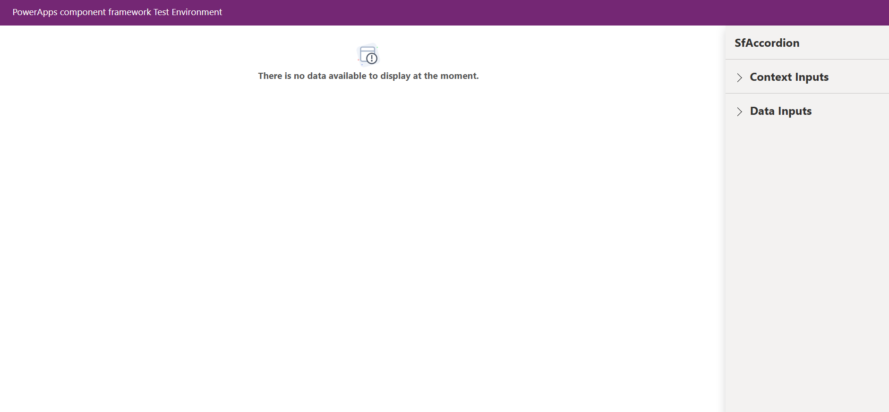
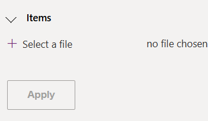
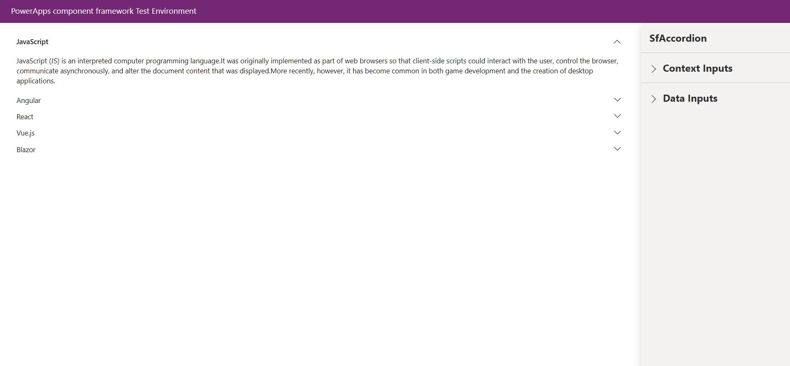

# Getting Started with Syncfusion Accordion Code Component in Local (TestHarness)

This article provides a step-by-step guide to run the Syncfusion Accordion code component in local (TestHarness).

## Prerequisites

Before getting started with the Syncfusion Accordion code component, ensure the following prerequisites are satisfied:

- [node.js  (>= v18.20.4)](https://nodejs.org/en/download/) (LTS version is recommended)
- [System requirements for Syncfusion React components](https://ej2.syncfusion.com/react/documentation/system-requirement)

## Rapid utilization of Accordion code component

To run the Syncfusion Accordion code component, follow these steps:

1. Ensure that all the prerequisites are met.

2. Open a command prompt (cmd) and navigate to the Accordion code component, which is located in the [components/accordion/](./) folder.

3. Utilize the following command to install the dependent packages:

    ```bash
    npm install
    ```

4. Execute the sample with the following command to visualize the Accordion code component:

    ```bash
    npm start watch
    ```

    

5. Now, within the `Data Inputs` section of the property pane, designate the items for the Accordion code component using the [**AccordionData.csv**](./data/AccordionData.csv).

    > [!NOTE]
    > After loading the items, proceed to select the required column types of Items section in the property pane. For example, assign the `Whole.None` column type for the `id` column of Items property.

    

6. After loading the CSV file, click the `Apply` button to load the items in the Accordion code component. Optionally, we can initialize Accordion config property data from the [**AccordionConfig.json**](./data/AccordionConfig.json) file.

    

7. Customize the Accordion code component properties in the right property pane.

> [!NOTE]
> Additionally, explore the [API documentation](../../docs/accordion/api.md) for comprehensive details on the properties, methods, and events of the Accordion code component.

## See also

- [Getting Started with the Syncfusion PowerApps Accordion Code Component in Canvas Application](../../docs/accordion/getting-started-with-canvas.md)

- [Getting Started with the Syncfusion PowerApps Accordion Code Component in Model-Driven Application (Custom Pages)](../../docs/accordion/getting-started-with-model-driven-custom-pages.md)
