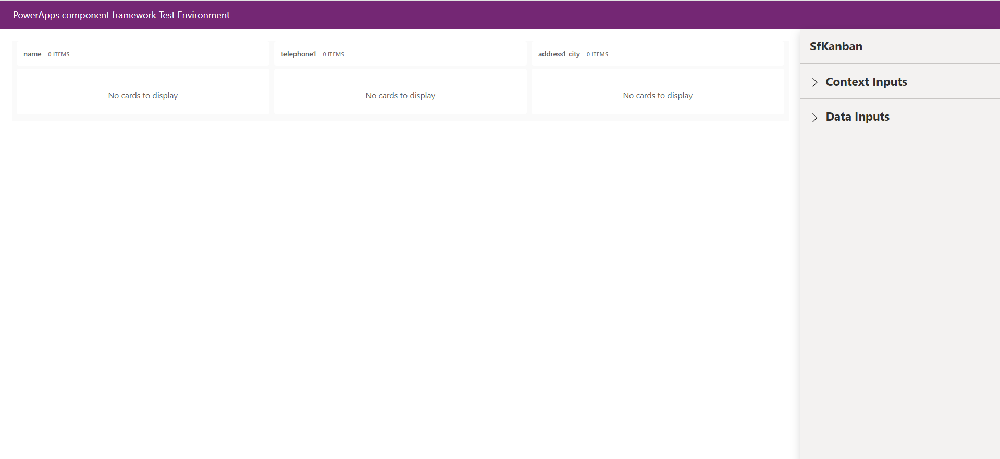
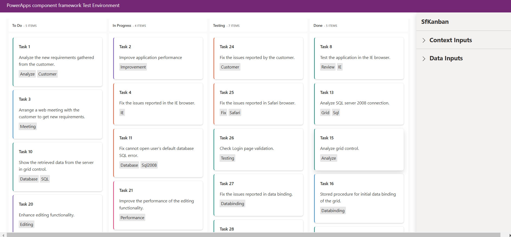

# Getting Started with Syncfusion Kanban Code Component in Local (TestHarness)

This article provides a step-by-step guide to run the Syncfusion Kanban code component in local (TestHarness).

## Prerequisites

Before getting started with the Syncfusion Kanban code component, ensure the following prerequisites are satisfied:

- [node.js  (>= v18.20.4)](https://nodejs.org/en/download/) (LTS version is recommended)
- [System requirements for Syncfusion React components](https://ej2.syncfusion.com/react/documentation/system-requirement)

## Rapid utilization of Kanban code component

To run the Syncfusion Kanban code component, follow these steps:

1. Ensure that all the prerequisites are met.

2. Open a command prompt (cmd) and navigate to the Kanban code component, which is located in the [components/kanban/](./) folder.

3. Utilize the following command to install the dependent packages:

    ```bash
    npm install
    ```

4. Execute the sample with the following command to visualize the Kanban code component:

    ```bash
    npm start watch
    ```

    

5. Now, within the `Data Inputs` section of the property pane, designate the data source for the Kanban code component using the [**KanbanData.csv**](./data/KanbanData.csv).

    > [!NOTE]
    > After loading the data source, proceed to select the required column types of DataSource section in the property pane. For example, assign the `SingleLine.Text` column type for the `Id` column of DataSource property.

    

6. After loading the CSV file, click the `Apply` button to load the data source in the Kanban code component.

7. Once the data is loaded, include the necessary kanbanConfig data for the Kanban code component by accessing the `kanbanConfig` property and paste the [**Kanban config data**](./data/kanbanConfig.json).

8. After loading the `kanbanConfig` data, ensure the keyField property is mapping the data in the Kanban board like assigning the value `Status` to the `keyField` property in the Kanban component. This is crucial for rendering the Kanban board layout correctly.

    

9. Customize the Kanban code component properties in the right property pane.

> [!NOTE]
> Additionally, explore the [API documentation](../../docs/kanban/api.md) for comprehensive details on the properties, methods, and events of the Kanban code component.

## See also

- [Getting Started with the Syncfusion PowerApps Kanban Code Component in Canvas Application](../../docs/kanban/getting-started-with-canvas.md)

- [Getting Started with the Syncfusion PowerApps Kanban Code Component in Model-Driven Application (Custom Pages)](../../docs/kanban/getting-started-with-model-driven-custom-pages.md)
