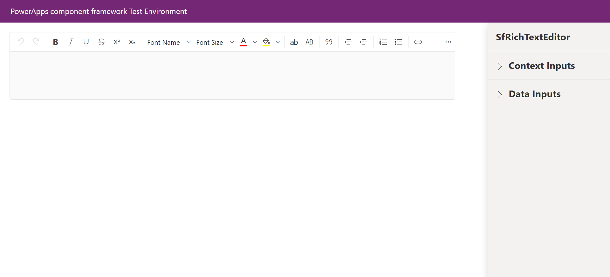

# Getting Started with Syncfusion RichTextEditor Code Component in Local (TestHarness)

This article provides a step-by-step guide to run the Syncfusion RichTextEditor code component in local (TestHarness).

## Prerequisites

Before getting started with the Syncfusion RichTextEditor code component, ensure the following prerequisites are satisfied:

- [node.js  (>= v18.20.4)](https://nodejs.org/en/download/) (LTS version is recommended)
- [System requirements for Syncfusion React components](https://ej2.syncfusion.com/react/documentation/system-requirement)

## Rapid utilization of RichTextEditor code component

To run the Syncfusion RichTextEditor code component, follow these steps:

1. Ensure that all the prerequisites are met.

2. Open a command prompt (cmd) and navigate to the RichTextEditor code component, which is located in the [components/richtexteditor/](./) folder.

3. Utilize the following command to install the dependent packages:

    ```bash
    npm install
    ```

4. Execute the sample with the following command to visualize the RichTextEditor code component:

    ```bash
    npm start watch
    ```

    

5. The RichTextEditor code component will be displayed with default properties. optionally paste the [RTEConfig](./data/rteConfig.json) JSON into the `RTEConfig` property as per the requirement. Customize the other properties in the right property pane.

> [!NOTE]
> Additionally, explore the [API documentation](../../docs/richtexteditor/api.md) for comprehensive details on the properties, methods, and events of the RichTextEditor code component.

## See also

- [Getting Started with the Syncfusion PowerApps RichTextEditor Code Component in Canvas Application](../../docs/richtexteditor/getting-started-with-canvas.md)

- [Getting Started with the Syncfusion PowerApps RichTextEditor Code Component in Model-Driven Application (Form)](../../docs/richtexteditor/getting-started-with-model-driven-form.md)

- [Getting Started with the Syncfusion PowerApps RichTextEditor Code Component in Model-Driven Application (Custom Pages)](../../docs/richtexteditor/getting-started-with-model-driven-custom-pages.md)

- [How to Load Syncfusion PowerApps RichTextEditor Code Component in PowerApps Form](../../docs/richtexteditor/how-to-load-rte-in-powerapps-form.md)
