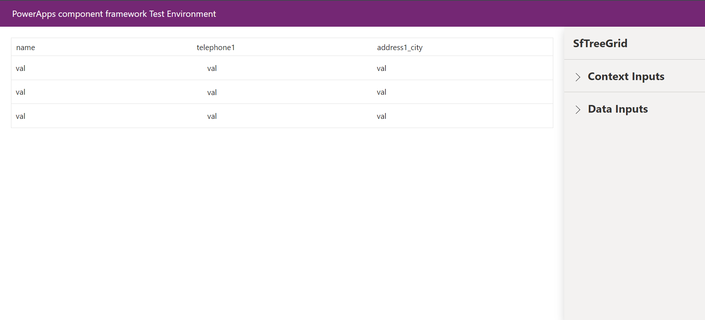
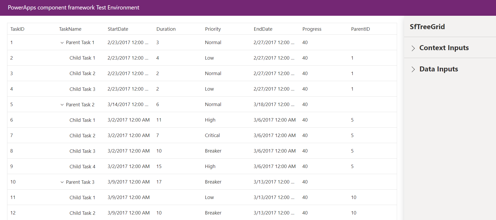

# Getting Started with Syncfusion TreeGrid Code Component in Local (TestHarness)

This article provides a step-by-step guide to run the Syncfusion TreeGrid code component in local (TestHarness).

## Prerequisites

Before getting started with the Syncfusion TreeGrid code component, ensure the following prerequisites are satisfied:

- [node.js  (>= v18.20.4)](https://nodejs.org/en/download/) (LTS version is recommended)
- [System requirements for Syncfusion React components](https://ej2.syncfusion.com/react/documentation/system-requirement)

## Rapid utilization of TreeGrid code component

To run the Syncfusion TreeGrid code component, follow these steps:

1. Ensure that all the prerequisites are met.

2. Open a command prompt (cmd) and navigate to the TreeGrid code component, which is located in the [components/treegrid/](./) folder.

3. Utilize the following command to install the dependent packages:

    ```bash
    npm install
    ```

4. Execute the sample with the following command to visualize the TreeGrid code component:

    ```bash
    npm start watch
    ```

    

5. Now, within the `Data Inputs` section of the property pane, designate the data source for the TreeGrid code component using the [**TreeGridData.csv**](../treegrid/data/TreeGridData.csv).

    > [!NOTE]
    > After loading the data source, proceed to select the required column types of DataSource section in the property pane. For example, assign the `Whole.None` column type for the `TaskID` column of DataSource property.

    

6. After loading the CSV file, click the `Apply` button to load the data source in the TreeGrid code component. Optionally, we can initialize TreeGrid config property data from the [**TreeGridConfig.json**](../treegrid/data/TreeGridConfig.json) file.

7. Once the data is loaded, set the `IdMapping` property to the ID column, such as `TaskID` and the `TreeColumnIndex` property to `1` to ensure that the fields are correctly mapped and the sample renders properly.

    

8. Customize the TreeGrid code component properties in the right property pane.

> [!NOTE]
> Additionally, explore the [API documentation](../../docs/treegrid/api.md) for comprehensive details on the properties, methods, and events of the TreeGrid code component.

## See also

- [Getting Started with the Syncfusion PowerApps TreeGrid Code Component in Canvas Application](../../docs/treegrid/getting-started-with-canvas.md)

- [Getting Started with the Syncfusion PowerApps TreeGrid Code Component in Model-Driven Application (Form)](../../docs/treegrid/getting-started-with-model-driven-form.md)

- [Getting Started with the Syncfusion PowerApps TreeGrid Code Component in Model-Driven Application (Custom Pages)](../../docs/treegrid/getting-started-with-model-driven-custom-pages.md)

- [Getting Started with the Syncfusion PowerApps TreeGrid Code Component in PowerPages](../../docs/treegrid/getting-started-with-power-pages.md)
