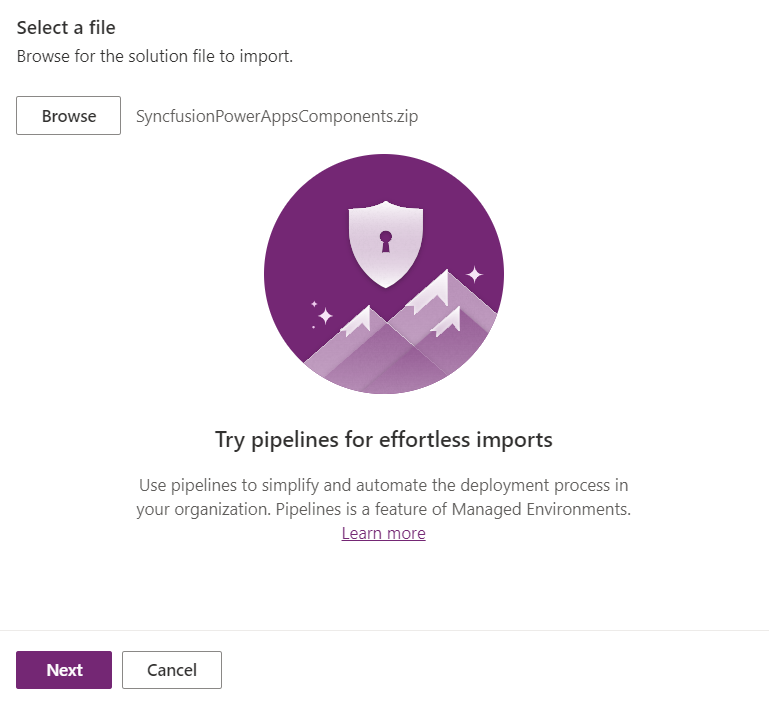
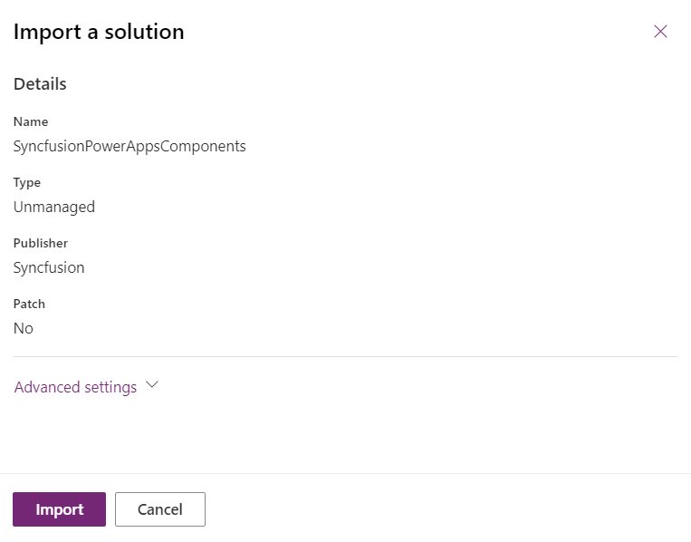
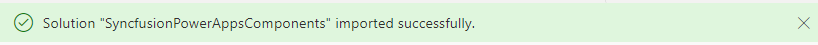
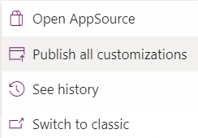
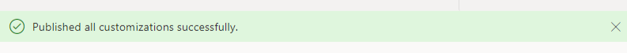

# Deployment of the solution package in the PowerApps portal manually

After generating the solution package, publish it in the PowerApps portal by following these steps:

1. Before proceeding, ensure that the file size limit for email attachments in PowerApps exceeds the size of your solution bundle. Check out the [FAQ section](./faq.md#how-to-set-file-size-limit-for-email-attachments-in-powerapps) for detailed instructions.

2. Open the [PowerApps portal](https://make.powerapps.com/) and navigate to the `Solutions` section. From the command bar, select `Import Solution`.

3. Click the `Browse` button and locate the solution package you generated at [`SyncfusionPowerAppsComponents/bin/release/SyncfusionPowerAppsComponents.zip`](../../SyncfusionPowerAppsComponents/bin/release/SyncfusionPowerAppsComponents.zip). Proceed to the next step by clicking `Next`.

    

4. Click `Import` to initiate the import process. Once completed, a success message will be displayed.

    

    

5. After successful import, click on the `Publish All Customizations` option in command bar to publish the solution package. Upon completion, a success message will confirm the publish.

    

    

> [!NOTE]
> Should you encounter any challenges during the importing process, refer to the [FAQ](../common/faq.md) page for assistance.
