# Frequently Asked Questions (FAQ)

This section contains the frequently asked questions (FAQ) about the Syncfusion PowerApps code components.

## Facing license issue while login to PowerApps?

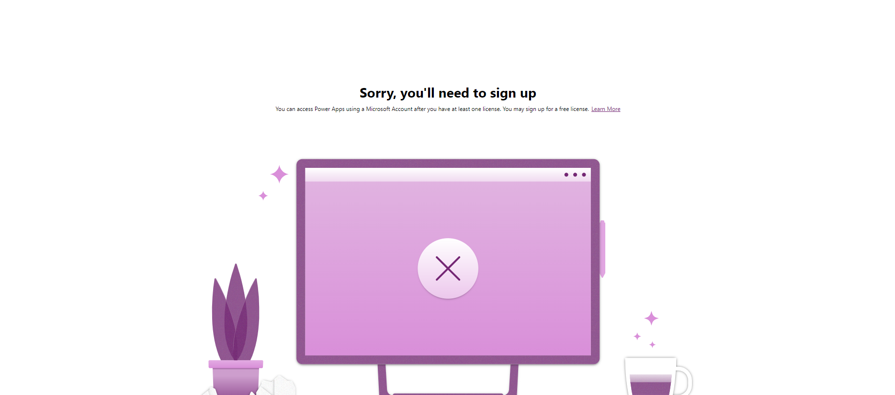

If you are facing a license issue while logging into PowerApps, please ensure that you have a valid PowerApps license. To obtain a PowerApps license, visit the [PowerApps website](https://www.microsoft.com/en-us/power-platform/products/power-apps/pricing).

## Whether personal Microsoft account can be used to login to Power Platform CLI?


No, personal Microsoft accounts cannot be used to login to Power Platform CLI. Only Organizational accounts can be used to login to Power Platform CLI.

## How to clear the login credentials in Power Platform CLI?

To clear the login credentials in Power Platform CLI, follow the below steps:

1. Open the command prompt and run the below command to clear the login credentials.

```bash
pac auth clear
```

2. After running the above command, the login credentials will be cleared.

## How to enable PAC framework support in a PowerApps environment?

To enable the PAC code component support in the PowerApps environment, follow the below steps:

1. Go to the [Power platform environments](https://admin.powerplatform.microsoft.com/environments) of your PowerApps account.

2. Select the environment and navigate to the below location
   > `Environment Actions (Three Dots)` -> `Settings` -> `Product` -> `Features`

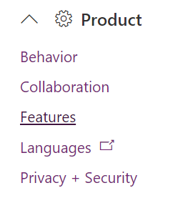

3. Enable the `Power Apps component framework for canvas apps` option and click the `save` button at the bottom of the page.

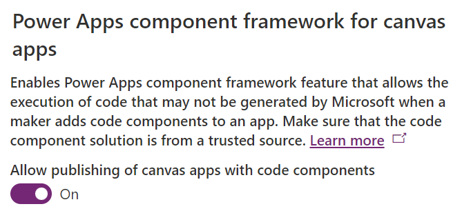

## How to address the missing prvCustomControl privilege for the custom control entity issue?

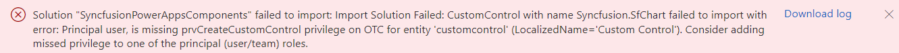

The "prvCustomControl" privilege error occurs when a user either lacks a valid PowerApps license or does not have the necessary permissions to create custom controls in the selected environment. Please visit the official [PowerApps License](https://www.microsoft.com/en-us/power-platform/products/power-apps/pricing) page to obtain the required license, or contact your administrator to request the appropriate permissions.

## How to resolve the webresource content size is too big issue?

The default file size limit for attachments of email in PowerApps is 5MB. If we upload the code components bundle greater than 5mb in powerApps `webresource content size is too big` issue will occur. To resolve the above mentioned issue, we need to update the file size limit for attachments of email as per the bundle size.

## How to set file size limit for email attachments in PowerApps?

To change the file size limit for email attachments in PowerApps, follow the below steps:

1. Go to the [Power portal](https://make.powerapps.com/) of your PowerApps account.

2. Navigate to `Settings` -> `Advanced Settings` location.

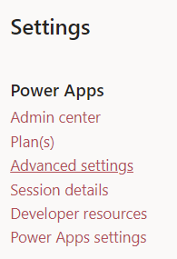

3. Now, the Dynamics 365 app will open in new tab. In that navigate to below location.

   > `Settings` -> `System` -> `Administration` -> `System Settings` -> `Email`

4. In `Email` tab, update the set file size limit for attachements as per the required size. After updating the changes click `ok`.

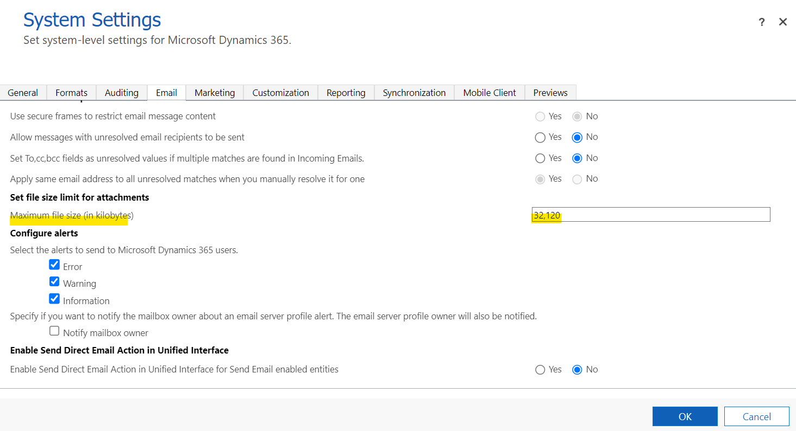

## How to resolve the pac is not internal or external command issue?

We need to install the Power Platform CLI tool in our local machine to resolve the above mentioned issue. To install the CLI tool, follow the below steps:

1. Install the Power Platform CLI for [windows MSI](https://learn.microsoft.com/en-us/power-platform/developer/howto/install-cli-msi#install), [Linux and macOS](https://learn.microsoft.com/en-us/power-platform/developer/cli/introduction?tabs=windows#install-microsoft-power-platform-cli) according to your operating system.

2. After installing the Power Platform CLI, close any existing command prompt windows and open a new command prompt. Then, run the following command to check the CLI tool is installed or not.

```bash
pac
```

## How to import data in a Dataverse table?

The following instructions explain how to import data into a Dataverse table if it exists, or else create a new table. Please follow the steps below:

1. We can import data into a Dataverse table using a CSV file for this example. Use the CSV files from the respective code component projects **data** folder.

   > For example, use the [Grid CSV](../../components/grids/data/GridData.csv) file from the Grid component project [**data**](../../components/grids/data/) folder.

2. In the [PowerApps portal](https://make.powerapps.com/), navigate to the `Tables` section and select `Import` -> `Import data` from the command bar.

3. Click the `Browse` button to locate and select the CSV file from respective code components. After selecting the CSV file, click the `Next` button.

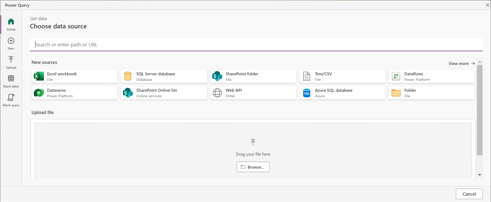

4. And preview the file data in the next step. After previewing the file data, click the `Next` button.

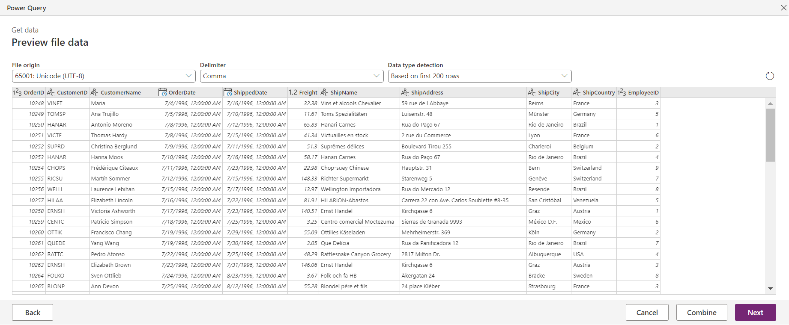

5. Click the `Next` button to proceed to the next step.

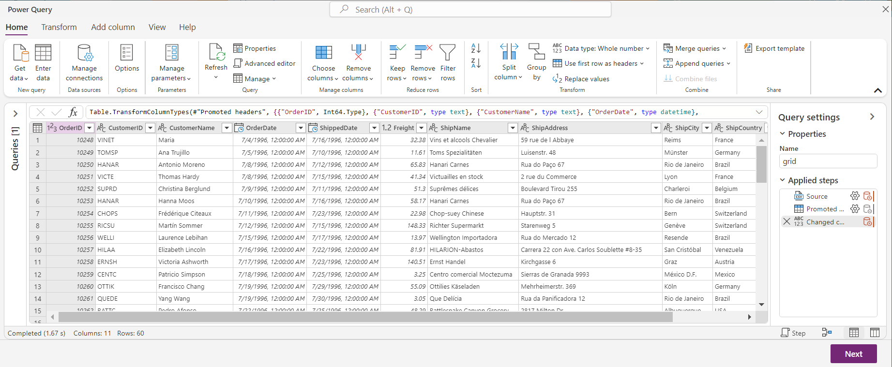

6. In the next step, enter the table name, table display name and unique primary name columns. After entering the details, click the `Next` button.

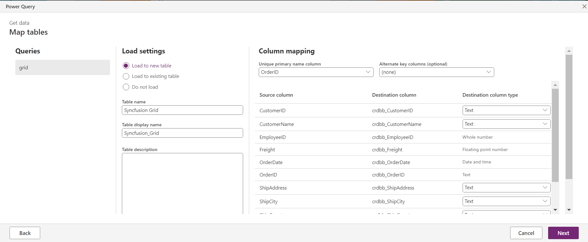

7. Click on `Publish` -> `Publish now` to create or update the table in the Dataverse.

8. Once the table is created, it will be listed with `Custom` tag. If the Dataverse table already exists, it will append the data to the table.

## How to create a new Dataverse table?

To create a new Dataverse table, follow these steps:

1. Go to the [PowerApps portal](https://make.powerapps.com/) and navigate to the `Table` tab in the left hand menu. This is where you manage and create Dataverse tables.

2. Click on `Create new tables` and select the option to `Import an Excel file or .CSV`.

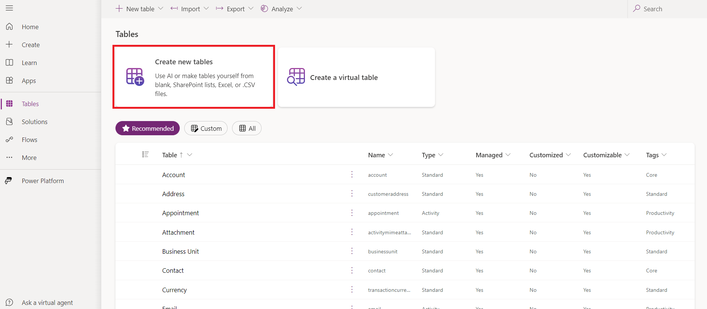

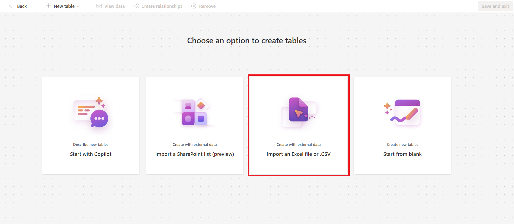

3. Upload the Excel or CSV file that defines the table schema. After uploading, click the created table and select `view data` to configure its properties. For example, you can use the [Grid CSV](../../components/grids/data/GridData.csv) file from the Grid component project [**data**](../../components/grids/data/) folder for importing.

> [!Important]
> Ensure that the column names and data types in the created table match those in the CSV file.

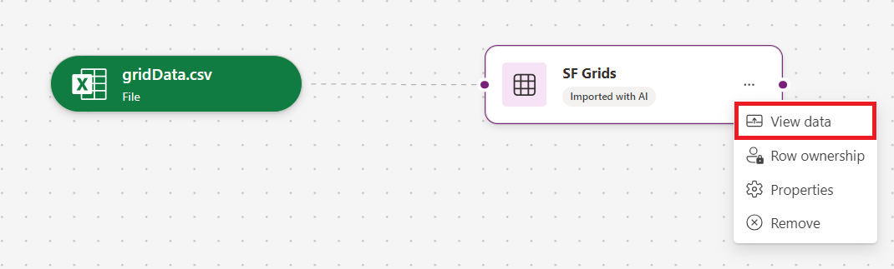

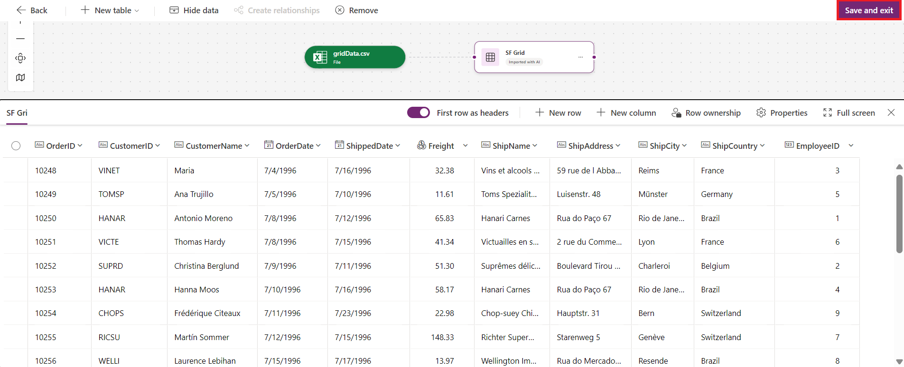

4. Click `Save and exit` to finalize the table creation in Dataverse.

5. After the table is created, it will appear in the `Tables` section under the `custom` tag.

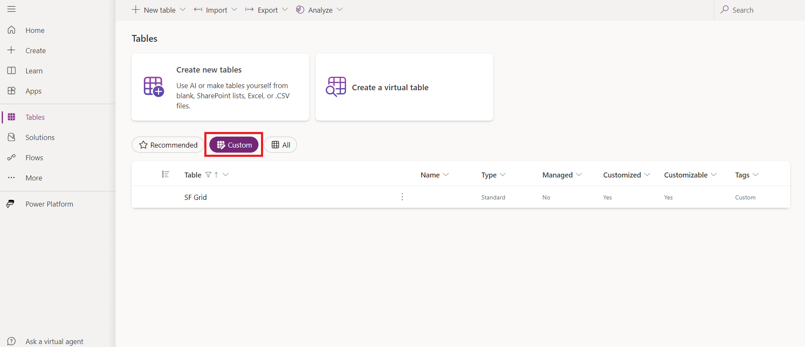

6. Go to the `Data experiences` tab for the created table, then click on `Views`.

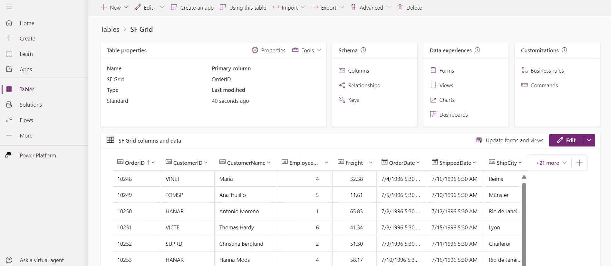

7. In the **default** `Public view`, modify the necessary column names. Once the changes are complete, click `Save and publish` button to apply the updates.

> [!IMPORTANT]
> Ensure whether the table is created with all rows and columns of the CSV file. If not, try [importing the data](#how-to-import-data-in-a-dataverse-table) into the table.

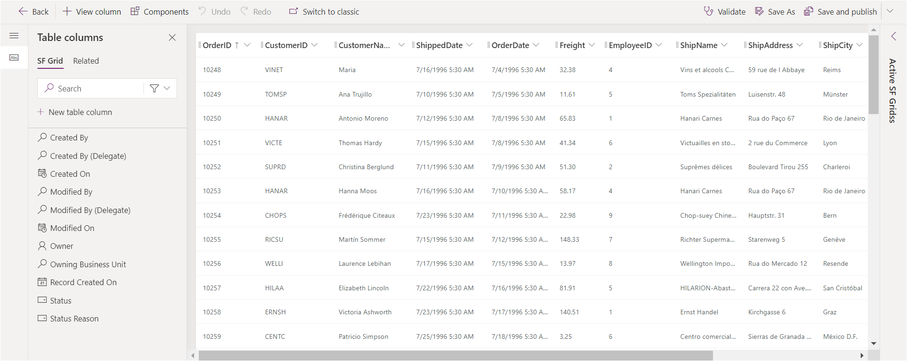
