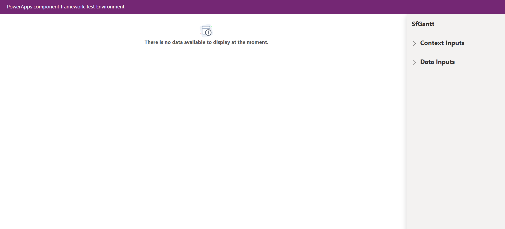
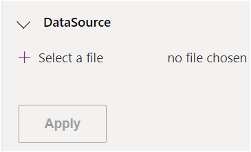
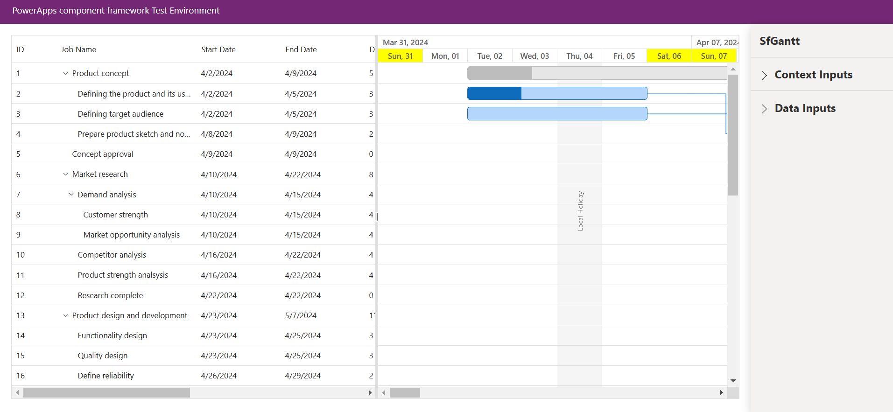

# Getting Started with Syncfusion Gantt Code Component in Local (TestHarness)

This article provides a step-by-step guide to run the Syncfusion Gantt code component in local (TestHarness).

## Prerequisites

Before getting started with the Syncfusion Gantt code component, ensure the following prerequisites are satisfied:

- [node.js  (>= v18.20.4)](https://nodejs.org/en/download/) (LTS version is recommended)
- [System requirements for Syncfusion React components](https://ej2.syncfusion.com/react/documentation/system-requirement)

## Rapid utilization of Gantt code component

To run the Syncfusion Gantt code component, follow these steps:

1. Ensure that all the prerequisites are met.

2. Open a command prompt (cmd) and navigate to the Gantt code component, which is located in the [components/gantt/](../../components/gantt/) folder.

3. Utilize the following command to install the dependent packages:

```bash
npm install
```

4. Execute the sample with the following command to visualize the Gantt code component:

```bash
npm start watch
```



5. Now, within the `Data Inputs` section of the property pane, designate the data source for the Gantt code component using the [**ganttData.csv**](../../components/gantt/data/ganttData.csv).

> [!NOTE]
> After loading the data source, proceed to select the required column types of DataSource section in the property pane. For example, assign the `Whole.None` column type for the `TaskID` column of DataSource property.



6. After loading the CSV file, click the `Apply` button to load the data source in the Gantt code component.

7. Once the data is loaded, include the necessary ganttConfig data for the Gantt code component by accessing the `ganttConfig` property and paste the [**Gantt config data**](../../components/gantt/data/ganttConfig.json).



8. Customize the Gantt code component properties in the right property pane.

> [!NOTE]
> Additionally, explore the [API documentation](./api.md) for comprehensive details on the properties, methods, and events of the Gantt code component.

## See also

- [Getting Started with the Syncfusion PowerApps Gantt Code Component in Canvas Application](getting-started-with-canvas.md)

- [Getting Started with the Syncfusion PowerApps Gantt Code Component in Model-Driven Application (Form)](getting-started-with-model-driven-form.md)

- [Getting Started with the Syncfusion PowerApps Gantt Code Component in Model-Driven Application (Custom Pages)](getting-started-with-model-driven-custom-pages.md)

- [Getting Started with the Syncfusion PowerApps Gantt Code Component in PowerPages](getting-started-with-power-pages.md)
