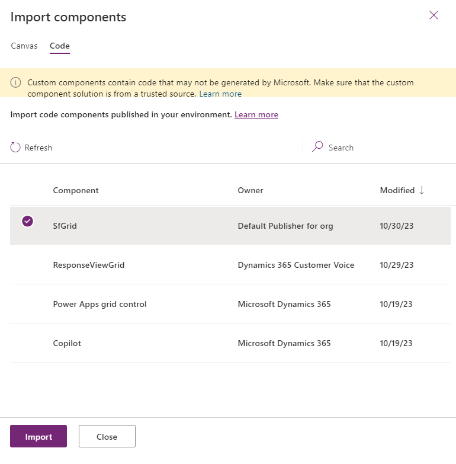
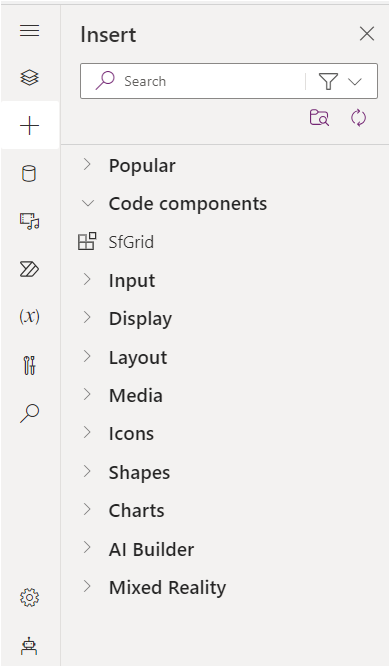
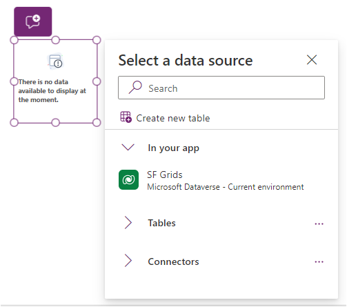
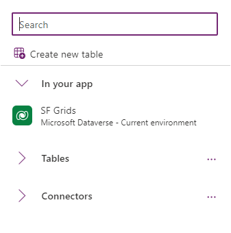
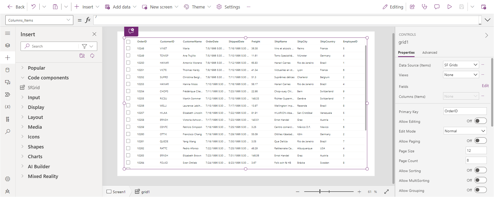
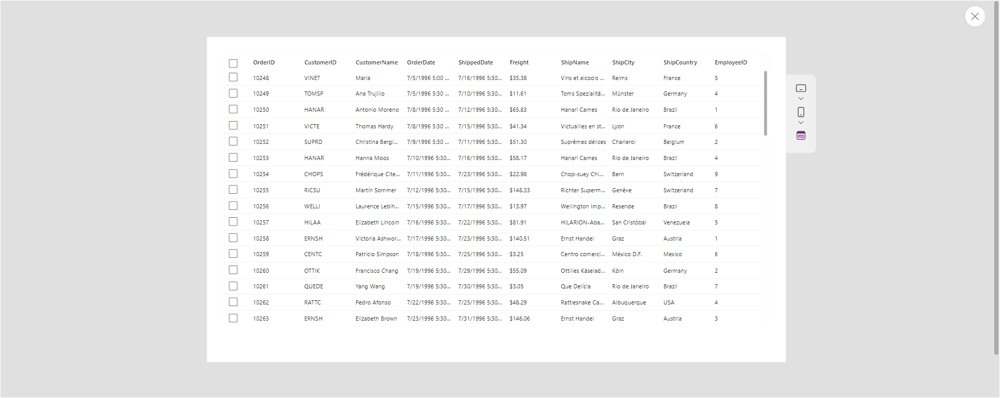
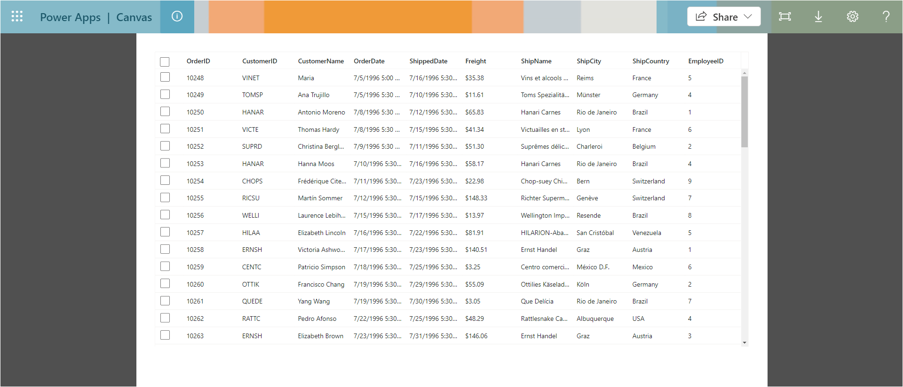

# Getting Started with Syncfusion PowerApps Grid Code Component in Canvas Application

This article provides a step-by-step guide for setting up a PowerApps canvas application and integrating the Syncfusion PowerApps Grid code component.

Power Apps canvas empowers users to design custom applications with a personalized interface, offering creative freedom. Its intuitive drag-and-drop features enable seamless integration of elements, ensuring flexibility in app development and dynamic user experiences with diverse data sources.

## Prerequisites

- [Published Syncfusion PowerApps solution package](../../README.md#deploying-the-solution-package-in-the-powerapps-portal)

## Create a new Dataverse table

Syncfusion PowerApps Grid code component requires data to be loaded from a data source. Follow the steps provided in [Create a new Dataverse table](../common/faq.md#how-to-create-a-new-dataverse-table) section to create a new table in Dataverse using the CSV in the Grid code component [data](../../components/grids/data/) folder. Skip this step if you have an existing table with data.

## Create a PowerApps canvas application

Initiate the creation of a canvas application by following these steps:

1. If you're creating the canvas application for the first time in your PowerApps environment, ensure to `enable the PowerApps component framework for canvas apps` support. Otherwise, proceed to the next step.

   > For detailed instructions, consult the [FAQ](../common/faq.md#how-to-enable-pac-framework-support-in-a-powerapps-environment).

2. Go to the [PowerApps portal](https://make.powerapps.com/), access the `Apps` tab from the left navigation pane, and click on `Start with a page design`.

3. Choose the `Blank canvas` option and specify either tablet or phone resolution.

4. The PowerApps blank canvas application will be generated as like below.

> [!NOTE]
> For additional guidance, refer to the [Create an blank canvas app in PowerApps](https://learn.microsoft.com/en-us/power-apps/maker/canvas-apps/create-blank-app) documentation.

## Import Syncfusion PowerApps Grid code component into canvas application

Integrating the Syncfusion PowerApps Grid code component into the blank canvas application involves the following steps:

1. Within the created blank canvas application, navigate to `Insert` -> `Get more components` icon below search bar.

2. Switch to the `code` tab and import the published solution package component `SfGrid`.

3. Once imported, you'll find the Syncfusion PowerApps Grid code component in the `code components` section.

## Add Syncfusion PowerApps Grid code component into canvas application

Enhance your canvas application by adding the Syncfusion PowerApps Grid code component using the following steps:

1. From the `Insert` tab, drag and drop the `SfGrid` component located in the `code components` section into your application layout.

2. To initialize the Grid code component with data from previously created Dataverse tables or connectors listed in the DataSource tab, simply click and load the data. Additionally, include the necessary columns data for the Grid code component by accessing the PowerFx tab of Columns property and paste the [PowerFx table columns](../../components/grids/data/PowerFxColumnData.txt).

> [!NOTE]
> When utilizing the `PowerFx table` or `Connectors` to access the data source, you can incorporate columns data by selecting `edit` in the Fields section located beneath the DataSource property. For additional information, please refer to the comprehensive [list of all connectors supported in PowerApps](https://learn.microsoft.com/en-us/connectors/connector-reference/connector-reference-powerapps-connectors).

3. Once the data is loaded, the output of the Grid code component will displayed. Customize the Grid code component properties in the right property pane and also via the PowerFx tab on top.

## Preview the Syncfusion PowerApps Grid application

To preview the Syncfusion PowerApps Grid application in development environment with multiple device resolution, click the `Preview` button at the top right corner of the PowerApps portal.

## Publish the Syncfusion PowerApps Grid application

To publish the Syncfusion PowerApps Grid application in the production environment, click the `Publish` button at the top right corner of the PowerApps portal. Now you can share the published application with your users.

Once the application is published, you can preview it by clicking the `play` button of the created Canvas application from the `Apps` tab on the homepage.

## Known limitations

- In canvas applications, it is important to note that the PowerApps entity save functionality is currently in an experimental phase. Moreover, it should be understood that columns utilizing Decimal and Float data types within Dataverse tables do not support saving operations within canvas. For comprehensive details regarding these considerations, please consult the provided links outlining the [constraints associated with setValue for entities](https://learn.microsoft.com/en-us/power-apps/developer/component-framework/reference/entityrecord/setvalue#limitations) and the [experimental nature of entity save](https://learn.microsoft.com/en-us/power-apps/developer/component-framework/reference/entityrecord/save#available-for).

- Columns property (Non-primary dataset) data loaded from Dataverse table in the canvas editor page's will not be available in the published canvas application. In such cases, you can utilize PowerFx table column data to load the component.

  > For example, you can use the [PowerFx table columns](../../components/grids/data/PowerFxColumnData.txt) to load columns data for the Grid code component.

## See also

- [Getting Started with the Syncfusion PowerApps Grid Code Component in Model-Driven Application (Form)](getting-started-with-model-driven-form.md)

- [Getting Started with the Syncfusion PowerApps Grid Code Component in Model-Driven Application (Custom Pages)](getting-started-with-model-driven-custom-pages.md)
