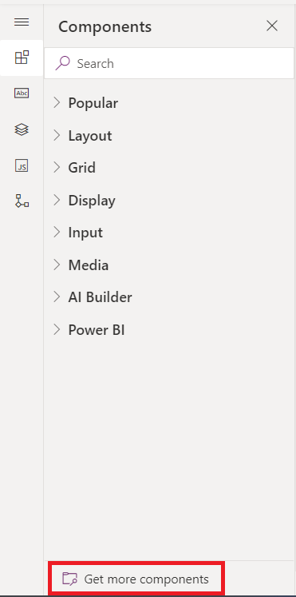
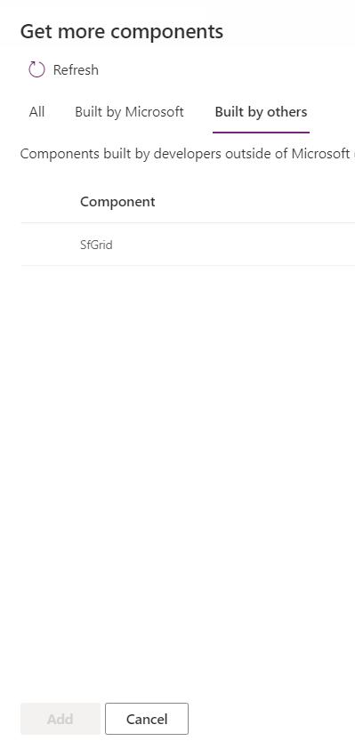
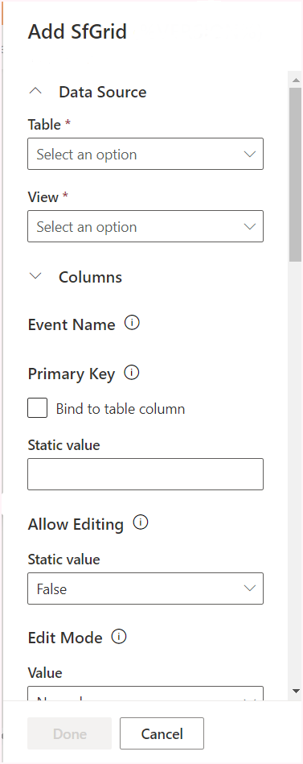
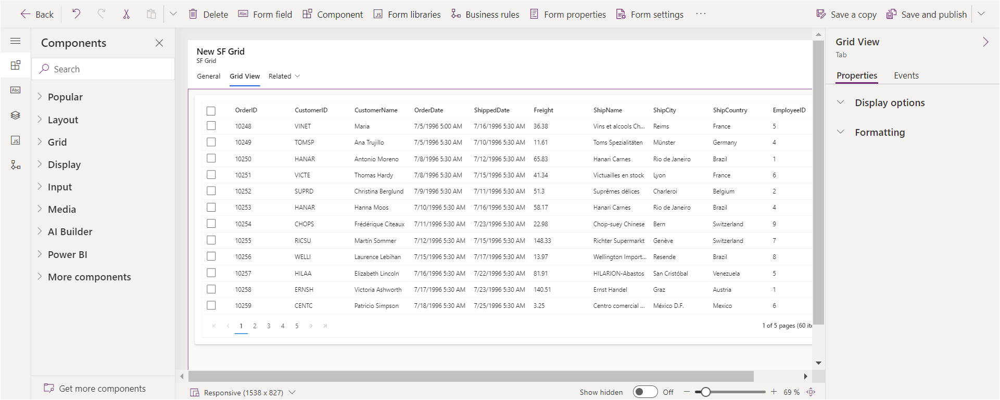
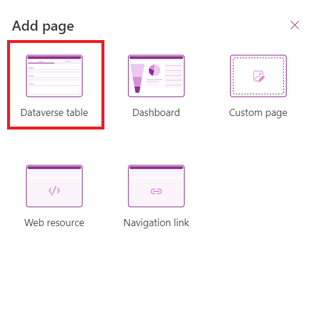
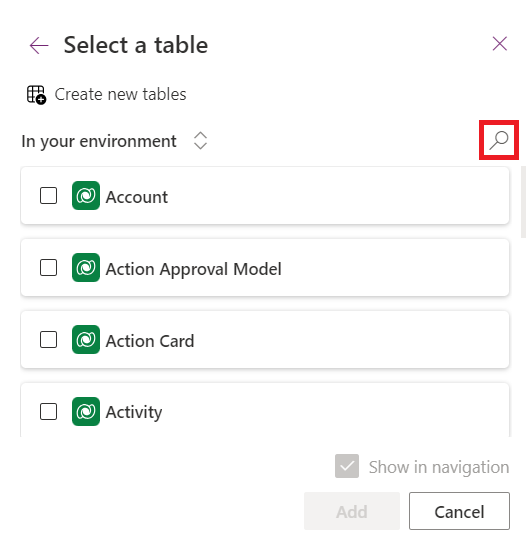
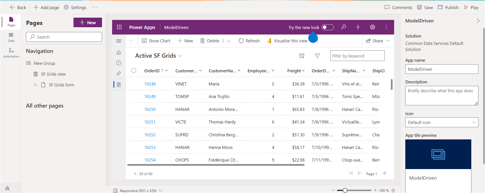
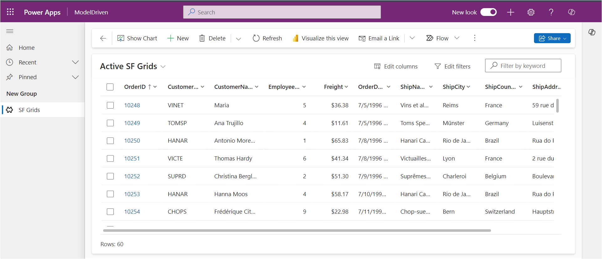
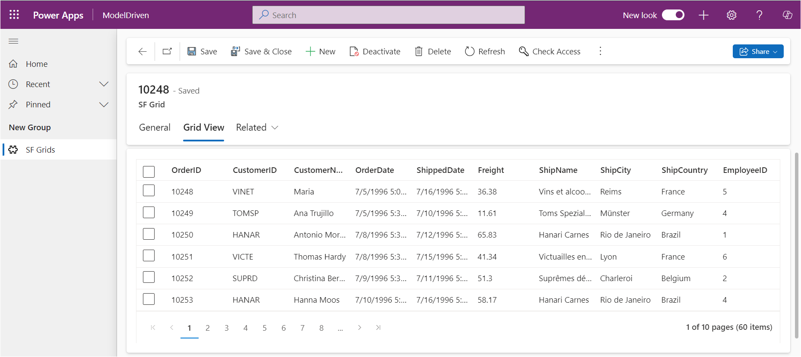

# Getting Started with Syncfusion PowerApps Grid Code Component in Model-Driven Application (Form)

This article provides a step-by-step guide for setting up a PowerApps model-driven application with Dataverse table form and integrating the Syncfusion PowerApps Grid code component.

PowerApps Model-Driven is a versatile platform for creating structured applications with a focus on data-centric design. It offers a guided approach, allowing users to build efficient business processes and workflows within a predefined data model.

## Prerequisites

- [Published Syncfusion PowerApps solution package](../../README.md#deploying-the-solution-package-in-the-powerapps-portal)

## Create a new Dataverse table

Syncfusion PowerApps Grid code component requires data to be loaded from a data source with column configuration. Follow the steps provided in [Create a new Dataverse table](../common/faq.md#how-to-create-a-new-dataverse-table) section to create a new table in Dataverse using the CSV in the Grid code component [data](../../components/grids/data/) folder for both `DataSource` & `Columns` property. Skip this step if you have an existing table with data.

## Add Syncfusion PowerApps Grid code component to the Dataverse table

To integrate the Syncfusion PowerApps Grid code component to the Dataverse table, follow the steps below:

1. In the Dataverse table, navigate to the `Forms` tab in the Data experiences pane to streamline data management. Locate the `Information` form with the **main** form type, which defines how users interact with and organize data effectively.

2. Within the left navigation pane of the `Information` form, locate the `Components` tab. Here, click on `Get more components` at the bottom of the tab.

3. A window will appear. Switch to the `Build by others` tab at the top and import the built code component named `SfGrid` from the published solutions.

4. Create a new section in the form, choosing for a `1-column tab` from the `popular` section. Rename this tab as **Grid View** to clearly delineate its purpose. This tab will be utilized to render the Grid code component.

5. Within the `More Components` section, select the `SfGrid` component. Configure the DataSource and Columns property of the Grid code component by accessing the list of Dataverse tables created previously with respective table views. This step ensures that the Grid code component is seamlessly connected to the relevant data. Also, customize the Grid code component properties in the property pane.

   > **Note**: It is optional to map Columns property with the Dataverse table columns. If you skip this step, the Grid code component will automatically map the columns based on the data source.

6. The output of the Grid code component will be displayed as shown below. Click the `Save and publish` button at the top right corner of the PowerApps portal. This action commits the changes made to the form, ensuring that the Syncfusion PowerApps Grid code component is now an integral part of the Dataverse table.

## Create a PowerApps model-driven application

To create a model-driven application, follow the steps below:

1. In the [PowerApps portal](https://make.powerapps.com/), navigate to the `Apps` tab located in the left navigation pane and select the `Start with a page design` option.

2. Opt for the `Blank page with navigation` option and assign a meaningful name for your model-driven application. Proceed by clicking `create`.

3. The PowerApps platform will generate a blank model-driven application based on your specifications. You are now ready to start building your application.

4. To incorporate data into your application, click on the `Add Page` button. Select `Dataverse table` for the data source & columns, and specify the particular table created in the previous steps.

5. The Syncfusion PowerApps Grid code component can be visible in the `Grid View` tab by navigating into a `Component Name` column data.

> [!NOTE]
> For more information, refer to the [Create an blank Model-Driven app in PowerApps](https://learn.microsoft.com/en-us/power-apps/maker/model-driven-apps/build-app-three-steps).

## Publish the Syncfusion PowerApps Grid application

To publish the Syncfusion PowerApps Grid Model-Driven application in the production environment, click the `Publish` button at the top right corner of the PowerApps portal.

After publishing the application, click the `play` button to preview the published application. You can also share the published application with your users.

## See also

- [Getting Started with the Syncfusion PowerApps Grid Code Component in Canvas Application](getting-started-with-canvas.md)

- [Getting Started with the Syncfusion PowerApps Grid Code Component in Model-Driven Application (Custom Pages)](getting-started-with-model-driven-custom-pages.md)
