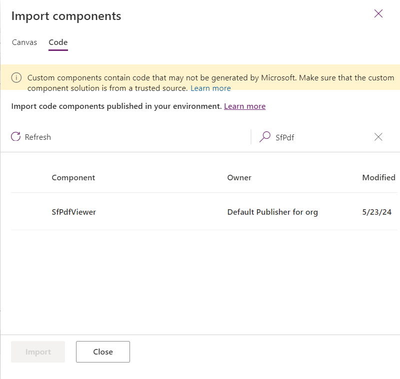
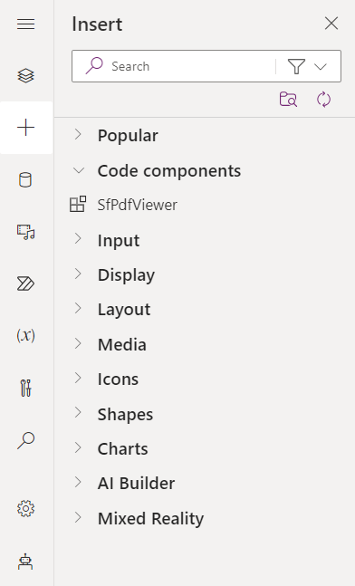
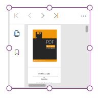
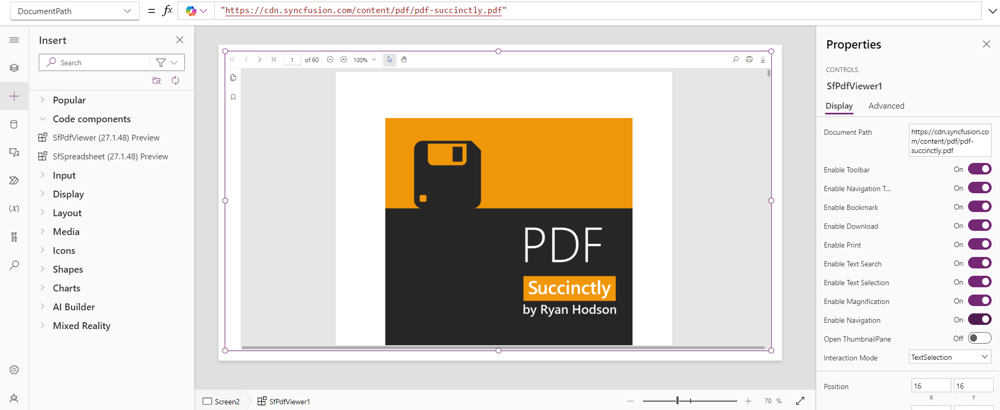
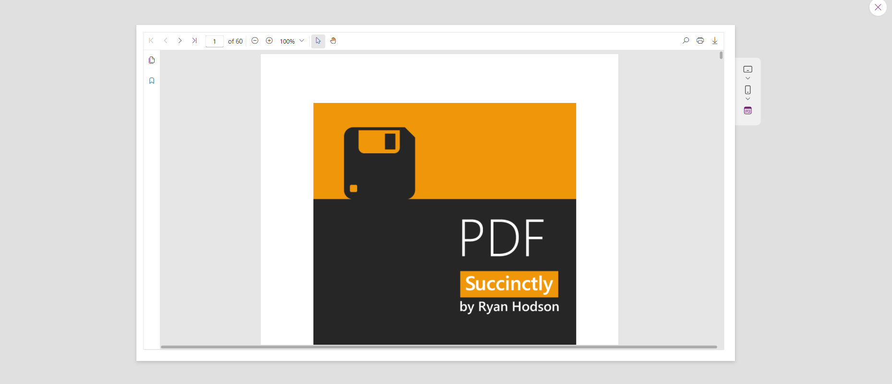
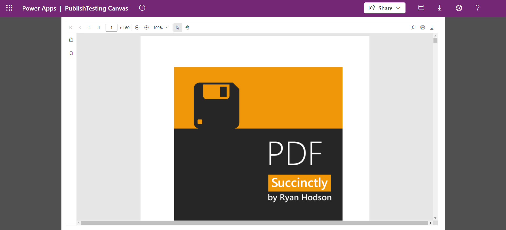

# Getting Started with Syncfusion PowerApps PdfViewer Code Component in Canvas Application

This article provides a step-by-step guide for setting up a PowerApps canvas application and integrating the Syncfusion PowerApps PdfViewer code component.

Power Apps canvas empowers users to design custom applications with a personalized interface, offering creative freedom. Its intuitive drag-and-drop features enable seamless integration of elements, ensuring flexibility in app development and dynamic user experiences with diverse data sources.

## Prerequisites

- [Published Syncfusion PowerApps solution package](../../README.md#deploying-the-solution-package-in-the-powerapps-portal)

## Create a PowerApps Canvas application

Initiate the creation of a canvas application by following these steps:

1. If you're creating the canvas application for the first time in your PowerApps environment, ensure to [`enable the PowerApps component framework for canvas apps`](../common/faq.md#how-to-enable-pac-framework-support-in-a-powerapps-environment) support. Otherwise, proceed to the next step.

2. Go to the [PowerApps portal](https://make.powerapps.com/), access the `Apps` tab from the left navigation pane, and click on `Start with a page design`.

    

3. Choose the `Blank canvas` option and specify either tablet or phone resolution.

    

4. The PowerApps blank canvas application will be generated as like below.

    

> [!NOTE]
> For additional guidance, refer to the [Create an blank canvas app in PowerApps](https://learn.microsoft.com/en-us/power-apps/maker/canvas-apps/create-blank-app) documentation.

## Import Syncfusion PowerApps PdfViewer code component into canvas application

Integrating the Syncfusion PowerApps PdfViewer code component into the blank canvas application involves the following steps:

1. Within the created blank canvas application, navigate to `Insert` -> `Get more components` icon below search bar.

    

2. Switch to the `code` tab and import the published solution package component `SfPdfViewer`.

    

3. Once imported, you'll find the Syncfusion PowerApps PdfViewer code component in the `code components` section.

    

## Add Syncfusion PowerApps PdfViewer code component into canvas application

Enhance your canvas application by adding the Syncfusion PowerApps PdfViewer code component using the following steps:

1. From the `Insert` tab on left pane, drag and drop the `SfPdfViewer` component located in the `code components` section into your application layout.

    

2. Initially, the PdfViewer code component will be displayed with default properties. Customize the PdfViewer code component properties in the right property pane and also via the PowerFx tab on top.

    > [!NOTE]
    > By default, the PdfViewer component is rendered with a 10% zoom level. You can adjust the zoom percentage through MagnificationTool in the toolbar settings.

3. Once the document is loaded, the output of the PdfViewer code component will displayed.

    

## Preview the Syncfusion PowerApps PdfViewer application

To preview the Syncfusion PowerApps PdfViewer application in development environment with multiple device resolution, click the `Preview` button at the top right corner of the PowerApps portal.

## Publish the Syncfusion PowerApps PdfViewer application

To publish the Syncfusion PowerApps PdfViewer application in the production environment, click the `Publish` button at the top right corner of the PowerApps portal. Now you can share the published application with your users.

Once the application is published, you can preview it by clicking the `play` button of the created Canvas application from the `Apps` tab on the homepage.

## See also

- [Getting Started with the Syncfusion PowerApps PdfViewer Code Component in Model-Driven Application (Form)](getting-started-with-model-driven-form.md)

- [Getting Started with the Syncfusion PowerApps PdfViewer Code Component in Model-Driven Application (Custom Pages)](getting-started-with-model-driven-custom-pages.md)
