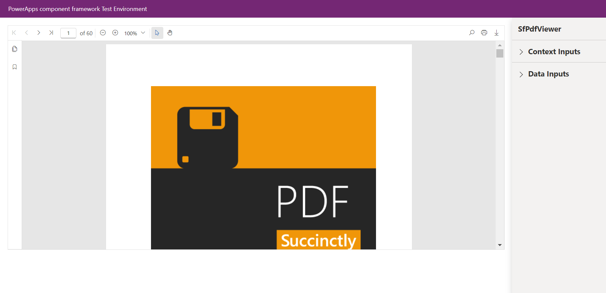

# Getting Started with Syncfusion PdfViewer Code Component in Local (TestHarness)

This article provides a step-by-step guide to run the Syncfusion PdfViewer code component in local (TestHarness).

## Prerequisites:

Before getting started with the Syncfusion PdfViewer code component, ensure the following prerequisites are satisfied:

- [node.js  (>= v18.20.4)](https://nodejs.org/en/download/) (LTS version is recommended)
- [System requirements for Syncfusion React components](https://ej2.syncfusion.com/react/documentation/system-requirement)

## Rapid utilization of PdfViewer code component

To run the Syncfusion PdfViewer code component, follow these steps:

1. Ensure that all the prerequisites are met.

2. Open a command prompt (cmd) and navigate to the PdfViewer code component, which is located in the [components/pdfviewer/](../../components/pdfviewer/) folder.

3. Utilize the following command to install the dependent packages:

```bash
npm install
```

4. Execute the sample with the following command to visualize the PdfViewer code component:

```bash
npm start watch
```



7. The PdfViewer code component will be displayed with default properties. Customize the PdfViewer code component properties in the right property pane.

> [!NOTE]
> Additionally, explore the [API documentation](./api.md) for comprehensive details on the properties, methods, and events of the PdfViewer code component.

## See also

- [Getting Started with the Syncfusion PowerApps PdfViewer Code Component in Canvas Application](getting-started-with-canvas.md)

- [Getting Started with the Syncfusion PowerApps PdfViewer Code Component in Model-Driven Application (Form)](getting-started-with-model-driven-form.md)

- [Getting Started with the Syncfusion PowerApps PdfViewer Code Component in Model-Driven Application (Custom Pages)](getting-started-with-model-driven-custom-pages.md)
