# How to Load Dataverse Files in the PdfViewer Code Component Using PowerAutomate

The Syncfusion PDFViewer code component is a versatile tool for viewing PDF files directly in your application. It supports loading files from multiple sources, including URLs and Base64 strings. This guide walks you through the process of retrieving and displaying a file stored in Dataverse in the PDF Viewer component using Power Automate.

## Prerequisites

- [Getting Started with Syncfusion PowerApps PdfViewer Code Component in Canvas Application](../pdfviewer/getting-started-with-canvas.md)

## Create a Dataverse table with a file column

To store files in Dataverse, you’ll need to set up a table with a file column. Follow the instructions in [Create a new Dataverse table with file column](../common/faq.md#how-to-create-a-dataverse-table-with-a-file-column-for-storing-files).

## Create and Configure a Power Automate Flow in Canvas Application

1. **Set Up a PowerApps Canvas Application**: Follow the steps in [Create a PowerApps Canvas application](./getting-started-with-canvas.md#create-a-powerapps-canvas-application) to set up your app. And then [Import PdfViewer Code Component](./getting-started-with-canvas.md#import-syncfusion-powerapps-pdfviewer-code-component-into-canvas-application) in the newly created Canvas application.

2. **Access Power Automate Tab**: In Canvas application, click `Power Automate` from the left navigation pane in the PowerApps portal in three dots menu.

  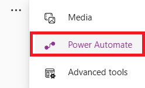

3. **Create New Flow**: In that, click on `Create new flow` and select `+ Create from blank` option.

  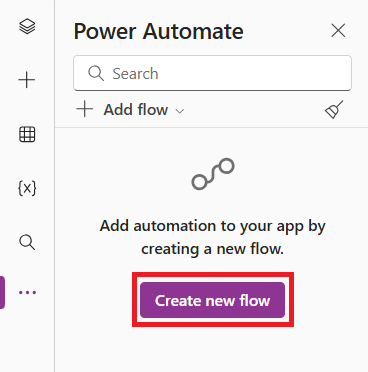

  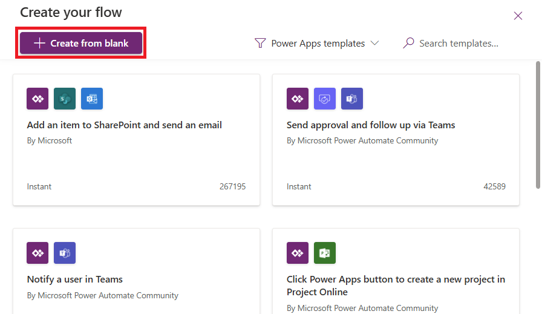

4. **Name Your Flow and Add Input**: Rename the flow to `GetFileFromDataverse`. In the `PowerApps v2` step, click **Add an input**, choose `Text`, and name the variable `ID`.

  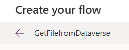

  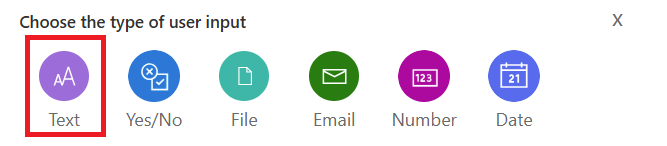

  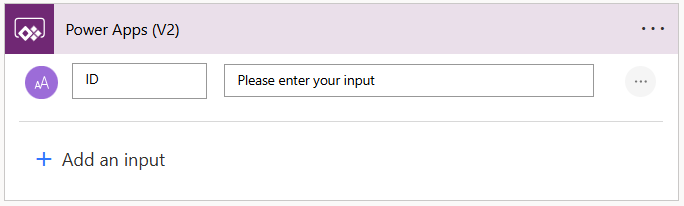

5. **Retrieve the File from Dataverse**: Add the **Download a file or an image** action from Dataverse. Select the table (`SF Files`), file column (`File`), and input variable (`ID`) as the Row ID. Rename the step as `File`.

  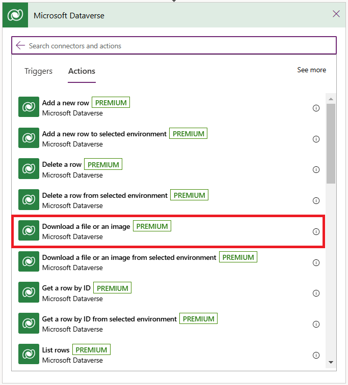

  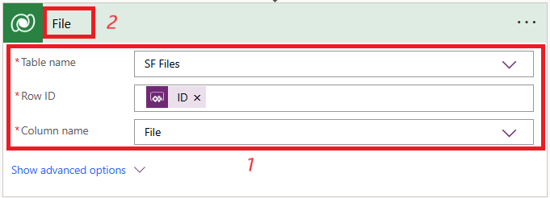

6. **Set Up the Output**: Add the **Respond to a Power App or flow** action. Add an output of type `Text` and use the following expression to fetch file content:

  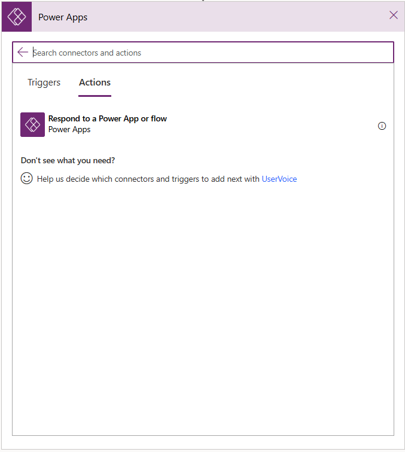

  

  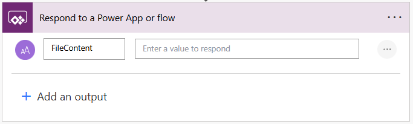

  ```json
  body('File')?['$content']
  ```

  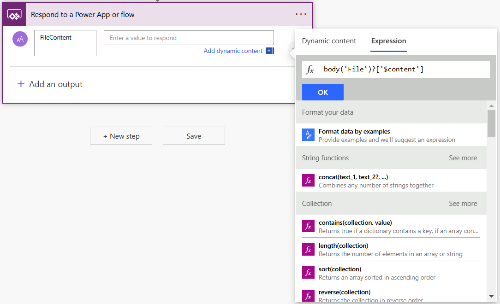

7. **Save and Load the Flow**: Click `Save` to finalize your flow. Ensure the flow is accessible in your PowerApps canvas application by loading it through the `Power Automate` tab.

  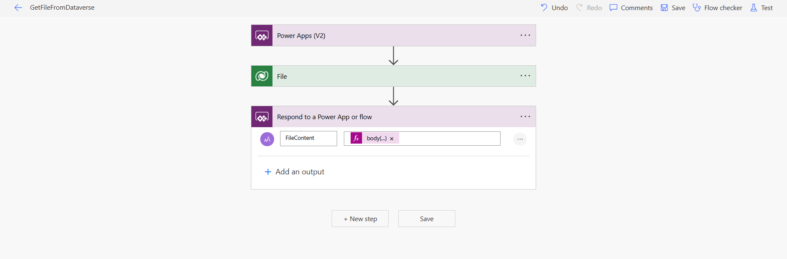

  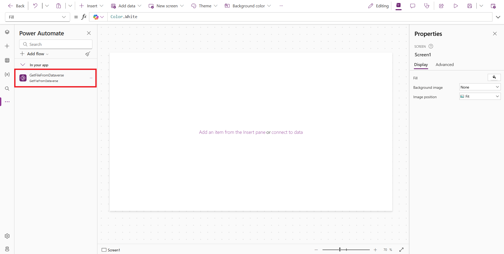

## Load Dataverse files in PdfViewer Code Component using PowerAutomate flow

1. **Add a Gallery for File Selection**: In your PowerApps Canvas application, insert a Vertical Gallery control and connect it to the `SF Files` table. Set the `OnSelect` property of the gallery to trigger the flow using this expression:

  ```json
  Set(
    DataverseFile,
    GetFileFromDataverse.Run(
        Match(
            Gallery1.Selected.File.Value,
            "rows/(?<value>[^/]+)/fileimageurl"
        ).value
    )
  );
  ```

  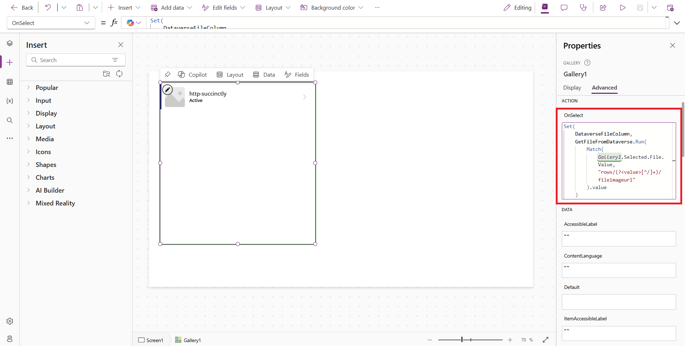

2. **Configure the PDF Viewer**: Add the SfPdfViewer component to your app layout. Set the Document property to load the file content using:

  ```json
  DataverseFile.filecontent
  ```

  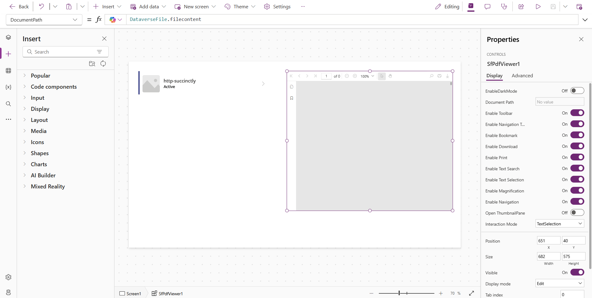

3. **Preview the Application**: Click the `Preview` button in the PowerApps portal. Select a file from the gallery to display it in the PDF Viewer component.

  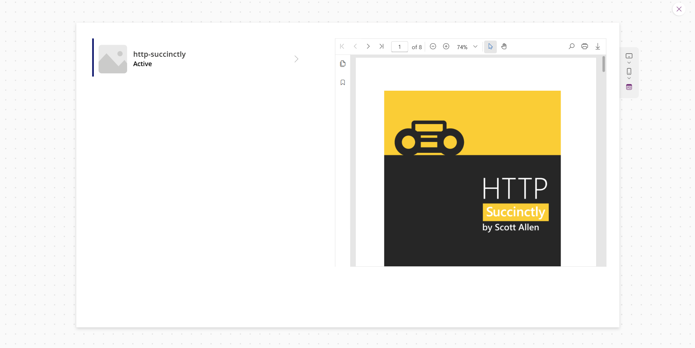

## See also

- [Getting Started with the Syncfusion PowerApps PdfViewer Code Component in Canvas Application](getting-started-with-canvas.md)

- [Getting Started with the Syncfusion PowerApps PdfViewer Code Component in Model-Driven Application (Form)](getting-started-with-model-driven-form.md)

- [Getting Started with the Syncfusion PowerApps PdfViewer Code Component in Model-Driven Application (Custom Pages)](getting-started-with-model-driven-custom-pages.md)
