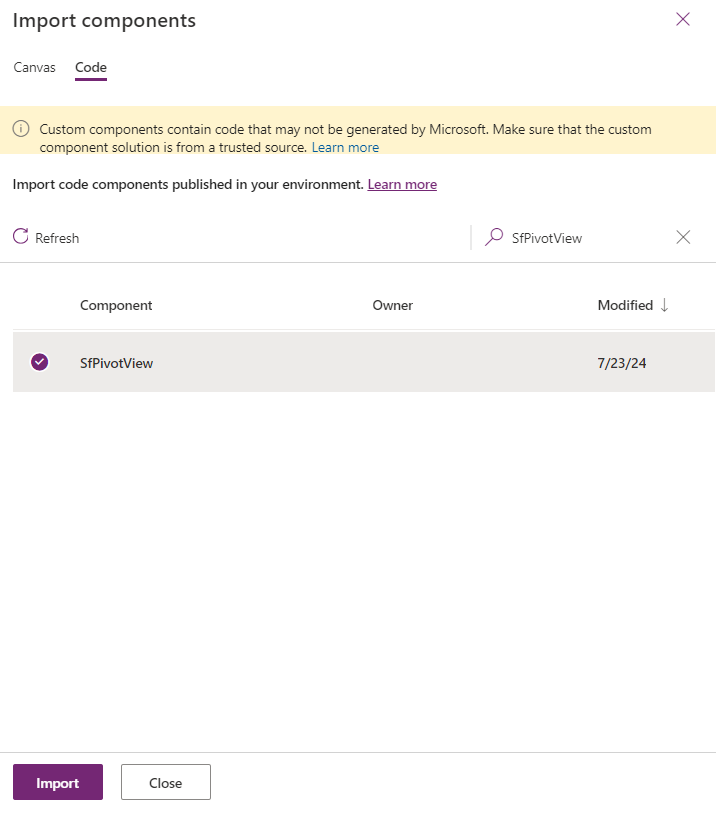
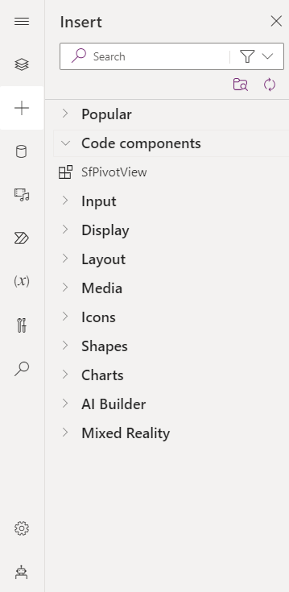
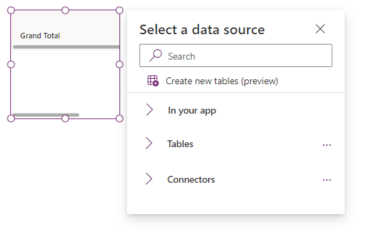
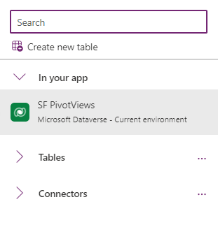
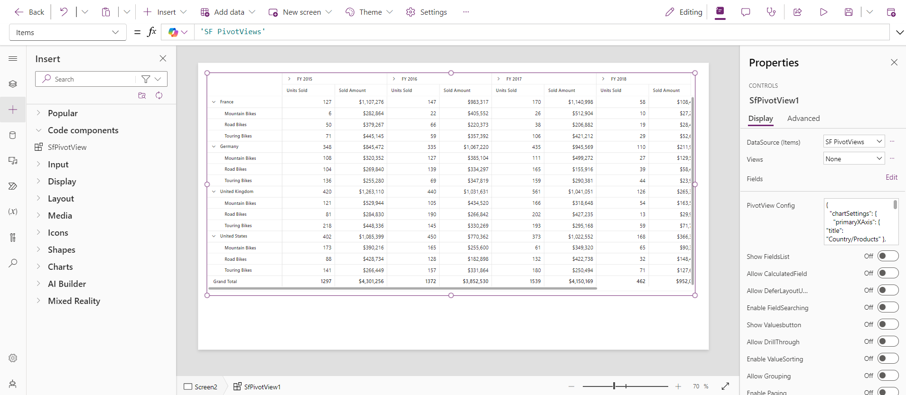
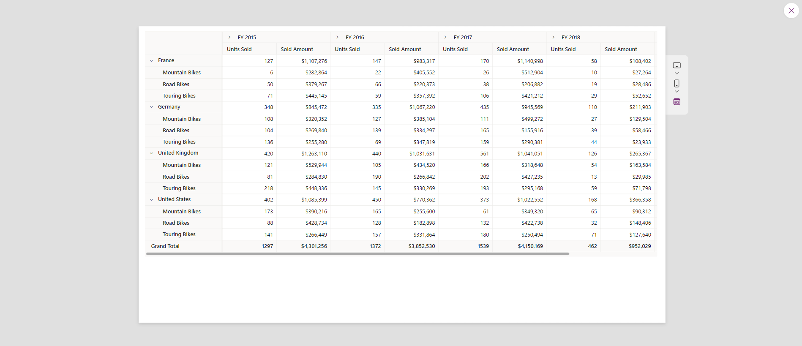
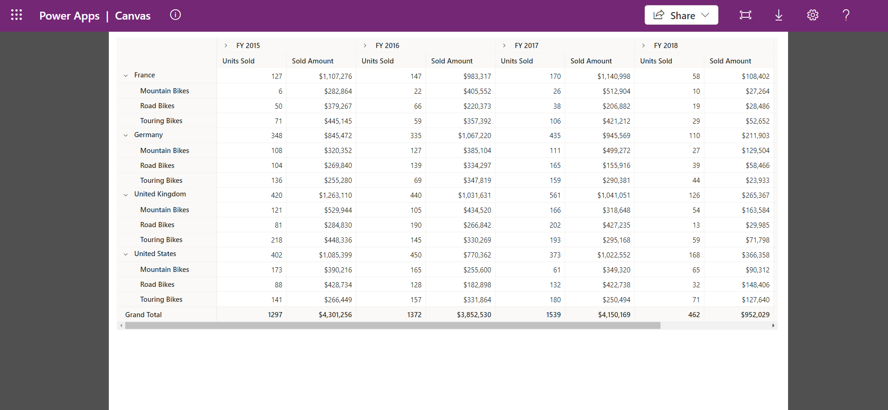

# Getting Started with Syncfusion PowerApps Pivotview Code Component in Canvas Application

This article provides a step-by-step guide for setting up a PowerApps canvas application and integrating the Syncfusion PowerApps Pivotview code component.

Power Apps canvas empowers users to design custom applications with a personalized interface, offering creative freedom. Its intuitive drag-and-drop features enable seamless integration of elements, ensuring flexibility in app development and dynamic user experiences with diverse data sources.

## Prerequisites

- [Published Syncfusion PowerApps solution package](../../README.md#deploying-the-solution-package-in-the-powerapps-portal)

## Create a new Dataverse table

Syncfusion PowerApps Pivotview code component requires data to be loaded from a data source. Follow the steps provided in [Create a new Dataverse table](../common/faq.md#how-to-create-a-new-dataverse-table) section to create a new table in Dataverse using the CSV in the Pivotview code component [data](../../components/pivotview/data/pivotViewData.csv) folder. Skip this step if you have an existing table with data.

When creating the Dataverse table using [CSV](../../components/pivotview/data/pivotViewData.csv) file, ensure the column names and data types match those in the table below:

| Column Name | DataType   |
|-------------|------------|
| Sold        | Whole.none |
| Amount      | Currency |
| Country     | SingleLine.Text |
| Products    | SingleLine.Text |
| Year        | SingleLine.Text |
| Quarter     | SingleLine.Text |

> [!NOTE]
> When setting up a Dataverse, make sure that the table columns are assigned the correct data types to prevent data loading issues in the PivotView code component.

## Create a PowerApps canvas application

1. If you're creating the canvas application for the first time in your PowerApps environment, ensure to [`enable the PowerApps component framework for canvas apps`](../common/faq.md#how-to-enable-pac-framework-support-in-a-powerapps-environment) support. Otherwise, proceed to the next step.

2. Go to the [PowerApps portal](https://make.powerapps.com/), access the `Apps` tab from the left navigation pane, and click on `Start with a page design`.

    

3. Choose the `Blank canvas` option and specify either tablet or phone resolution.

    

4. The PowerApps blank canvas application will be generated as like below.

    

> [!NOTE]
> For additional guidance, refer to the [Create an blank canvas app in PowerApps](https://learn.microsoft.com/en-us/power-apps/maker/canvas-apps/create-blank-app) documentation.

## Import Syncfusion PowerApps Pivotview code component into canvas application

Integrating the Syncfusion PowerApps Pivotview code component into the blank canvas application involves the following steps:

1. Within the created blank canvas application, navigate to `Insert` -> `Get more components` icon below search bar.

    

2. Switch to the `code` tab and import the published solution package component `SfPivotView`.

    

3. Once imported, you'll find the Syncfusion PowerApps Pivotview code component in the `code components` section.

    

## Add Syncfusion PowerApps Pivotview code component into canvas application

Enhance your canvas application by adding the Syncfusion PowerApps Pivotview code component using the following steps:

1. From the `Insert` tab, drag and drop the `SfPivotView` component located in the `code components` section into your application layout.

    

2. To initialize the Pivotview code component with data from previously created Dataverse tables or connectors listed in the DataSource tab, simply click and load the data.

    > [!NOTE]
    > When utilizing the `PowerFx table` or `Connectors` to access the data source, you can incorporate columns data by selecting `edit` in the Fields section located beneath the DataSource property. For additional information, please refer to the comprehensive [list of all connectors supported in PowerApps](https://learn.microsoft.com/en-us/connectors/connector-reference/connector-reference-powerapps-connectors).

    

3. Once the data is loaded, include the necessary pivotViewConfig data for the Pivotview code component by accessing the `pivotViewConfig` property and paste the [**PivotView config data**](../../components/pivotview/data/pivotViewConfig.json).

4. The output of the Pivotview code component will displayed. Customize the Pivotview code component properties in the right property pane and also via the PowerFx tab on top.

    

## Preview the Syncfusion PowerApps Pivotview application

To preview the Syncfusion PowerApps Pivotview application in development environment with multiple device resolution, click the `Preview` button at the top right corner of the PowerApps portal.

## Publish the Syncfusion PowerApps Pivotview application

To publish the Syncfusion PowerApps Pivotview application in the production environment, click the `Publish` button at the top right corner of the PowerApps portal. Now you can share the published application with your users.

Once the application is published, you can preview it by clicking the `play` button of the created canvas application from the `Apps` tab on the homepage.

## See also

- [Getting Started with the Syncfusion PowerApps Pivotview Code Component in Model-Driven Application (Form)](getting-started-with-model-driven-form.md)

- [Getting Started with the Syncfusion PowerApps Pivotview Code Component in Model-Driven Application (Custom Pages)](getting-started-with-model-driven-custom-pages.md)

- [Getting Started with the Syncfusion PowerApps Pivotview Code Component in PowerPages](getting-started-with-power-pages.md)
