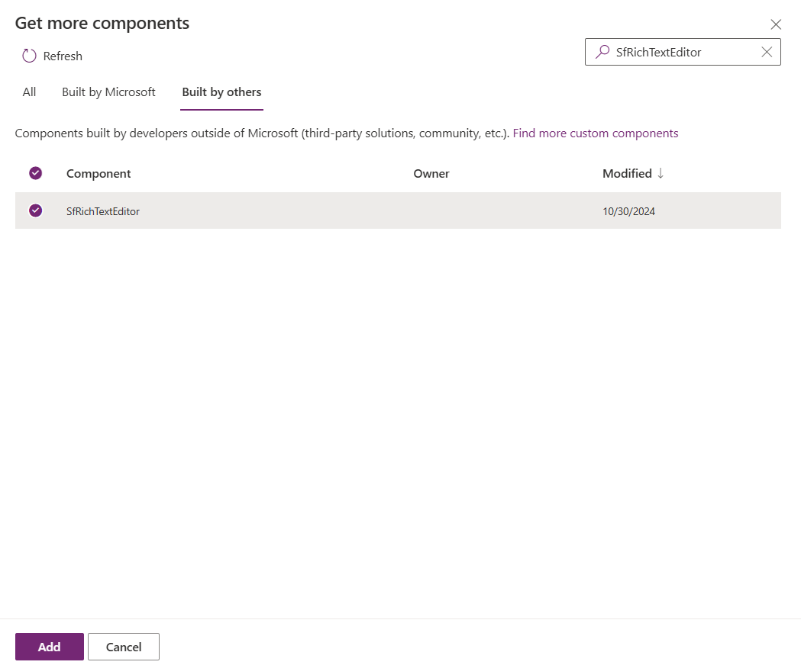
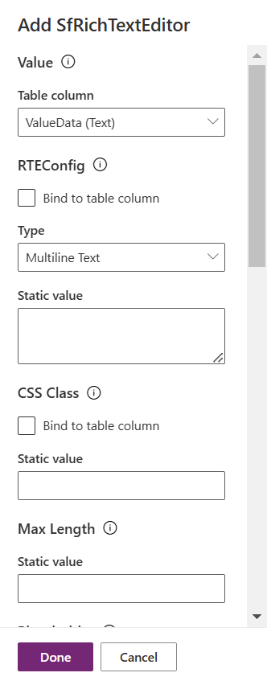
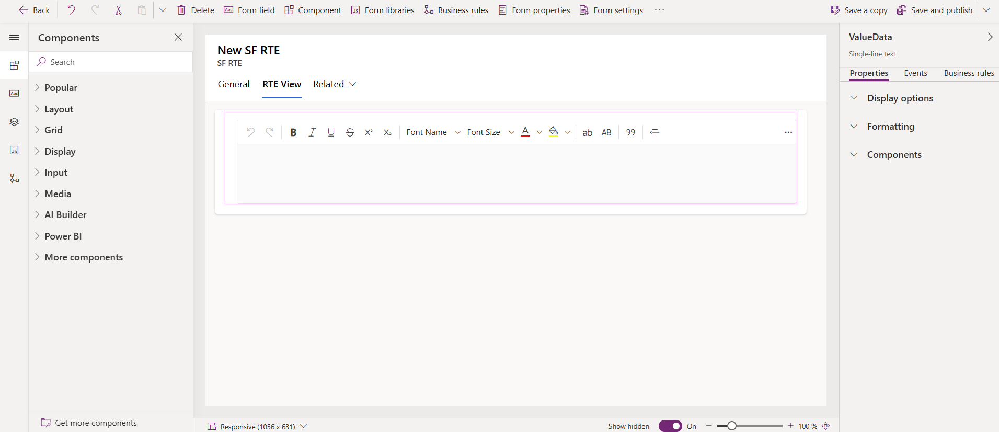
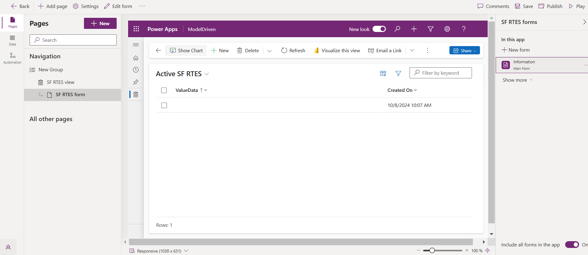
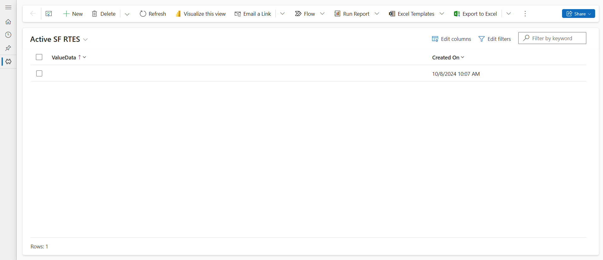
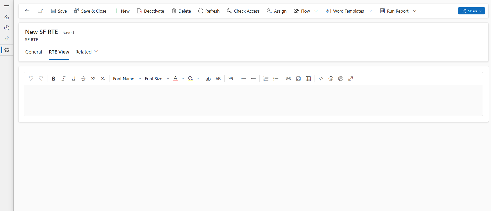

# Getting Started with Syncfusion PowerApps RichTextEditor Code Component in Model-Driven Application (Form)

This article provides a step-by-step guide for setting up a PowerApps model-driven application with Dataverse table form and integrating the Syncfusion PowerApps RichTextEditor code component.

PowerApps Model-Driven is a versatile platform for creating structured applications with a focus on data-centric design. It offers a guided approach, allowing users to build efficient business processes and workflows within a predefined data model.

## Prerequisites

- [Published Syncfusion PowerApps solution package](../../README.md#deploying-the-solution-package-in-the-powerapps-portal)

## Create a new Dataverse table

Syncfusion PowerApps RichTextEditor code component requires data to be loaded from a Dataverse column. Follow the steps provided in [Create a new Dataverse table](../common/faq.md#how-to-create-a-new-dataverse-table) section to create a new table in Dataverse using the CSV in the RichTextEditor code component [data](../../components/richtexteditor/data/data.csv) folder for `Value` property. Skip this step if you have an existing table with data.

## Add Syncfusion PowerApps RichTextEditor code component to the Dataverse table

To add the Syncfusion PowerApps RichTextEditor code component to the Dataverse table, follow the steps below:

1. In the Dataverse table, find the `Forms` tab in the Data experiences pane to streamline data management. Locate the `Information` form with the **main** form type to define how users interact with and organize data effectively.

2. Within the left navigation pane of the `Information` form, locate the `Components` tab. Here, click on `Get more components` at the bottom of the tab.

    

3. A window will appear. Switch to the `Build by others` tab at the top and import the built code component named `SfRichTextEditor` from the published solutions.

    

4. Create a new section in the form, opting for a `1-column tab` from the `popular` section. Rename this tab as **RTE View** to clearly delineate its purpose. This tab will be utilized to render the RichTextEditor code component.

5. Within the `More Components` section, select the `SfRichTextEditor` component. Configure the Value property of the RichTextEditor code component by assigning the Dataverse tables any one column created previously. This step ensures that the RichTextEditor code component is seamlessly connected to the relevant data. We can also use the optional [RTEConfig](../../components/richtexteditor/data/rteConfig.json) JSON configuration to configure the RichTextEditor code component. Also, customize other properties as needed.

    

6. The output of the RichTextEditor code component will appear as shown below. Click the `Save and publish` button at the top right corner of the PowerApps portal. This action commits the changes made to the form, ensuring that the Syncfusion PowerApps RichTextEditor code component is now an integral part of the Dataverse table.

    

## Create a PowerApps model driven application

To create a model-driven application, follow the steps below:

1. In the [PowerApps portal](https://make.powerapps.com/), navigate to the `Apps` tab in the left navigation pane and click on the `Start with a page design` option.

    

2. Choose the `Blank page with navigation` option and provide a meaningful name for your model-driven application. Proceed by clicking `create`.

    

3. The PowerApps platform will generate a blank model-driven application based on your specifications. You are now ready to start building your application.

    

4. To incorporate data into your application, click on the `Add Page` button. Choose `Dataverse table` for the data source & columns, and select the specific table you created in the previous steps.

    

    

5. The Syncfusion PowerApps RichTextEditor code component can be visible in the form by navigating into a any column data.

    

> For more information, refer to the [Create an blank model driven app in PowerApps](https://learn.microsoft.com/en-us/power-apps/maker/model-driven-apps/build-app-three-steps).

## Publish the Syncfusion PowerApps RichTextEditor application

To publish the Syncfusion PowerApps RichTextEditor model driven application in the production environment, click the `Publish` button at the top right corner of the PowerApps portal.

After publishing the application, click the `play` button to preview the published application. You can also share the published application with your users.

## See also

- [Getting Started with the Syncfusion PowerApps RichTextEditor Code Component in Canvas Application](getting-started-with-canvas.md)

- [Getting Started with the Syncfusion PowerApps RichTextEditor Code Component in Model-Driven Application (Custom Pages)](getting-started-with-model-driven-custom-pages.md)
