# How to Load Syncfusion PowerApps RichTextEditor Code Component in PowerApps Form

This article provides a step-by-step guide for How to Load Syncfusion PowerApps RichTextEditor Code Component in PowerApps Form.

## Prerequisites

- [Published Syncfusion PowerApps solution package](../../README.md#deploying-the-solution-package-in-the-powerapps-portal)

## Create a new Dataverse table

Syncfusion PowerApps RichTextEditor code component requires data to be loaded from a Dataverse column. Follow the steps provided in [Create a new Dataverse table](../common/faq.md#how-to-create-a-new-dataverse-table). Skip this step if you have an existing table with data.

Create the Dataverse table as outlined below to connect it with the RichTextEditor component:

| Column Name    | DataType   |
|----------------|------------|
| RichTextEditor | SingleLine.Text |
| Description    | Multiple lines of text |

> [!NOTE]
> When setting up the Dataverse table, ensure that the Description column is configured to support HTML content for compatibility with the RichTextEditor component.

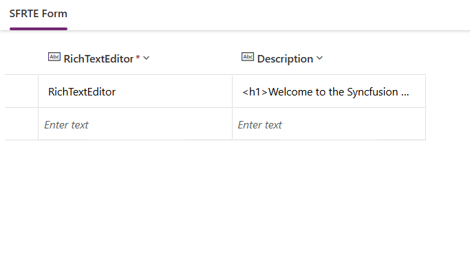

## Create a Canvas application

- Initiate the creation of a canvas application by following these docs [Create a PowerApps Canvas application](./getting-started-with-canvas.md#create-a-powerapps-canvas-application).

## Add Gallery & Form in Canvas Application

Integrating the Gallery & Form into the blank canvas application involves the following steps:

1. Within the created blank canvas application, navigate to `Insert` -> `Popular` Section.

    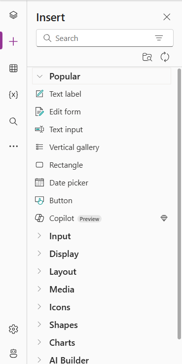

2. Drag and drop the `Vertical gallery` component located in the `Popular` section into your application layout.

    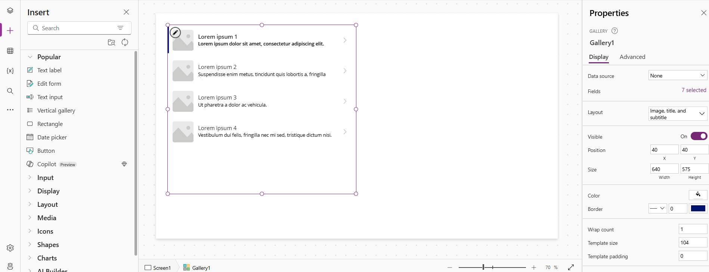

3. Drag and drop the `Edit Form` component located in the `Popular` section into your application layout.

    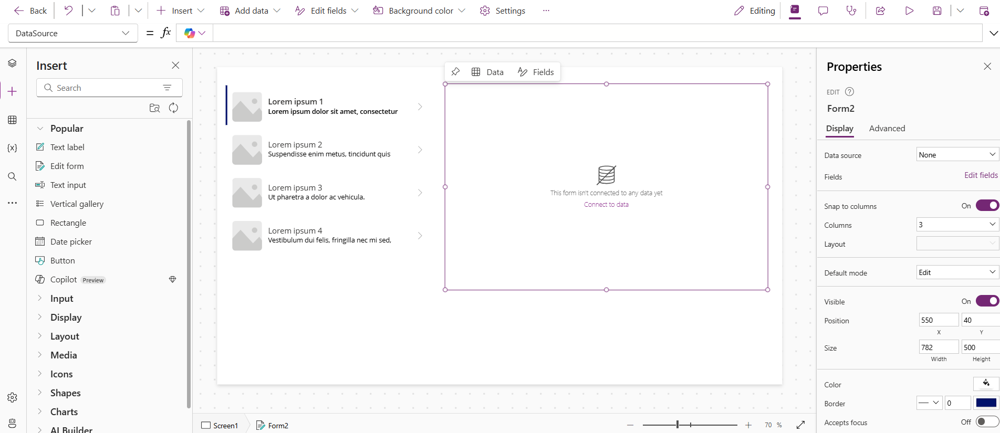

4. To initialize the Vertical gallery and Edit form component with data from previously created Dataverse tables or connectors listed in the DataSource tab, simply click and load the data.

    > [!NOTE]
    > When utilizing the `PowerFx table` or `Connectors` to access the data source, you can incorporate columns data by selecting `edit` in the Fields section located beneath the DataSource property. For additional information, please refer to the comprehensive [list of all connectors supported in PowerApps](https://learn.microsoft.com/en-us/connectors/connector-reference/connector-reference-powerapps-connectors).

    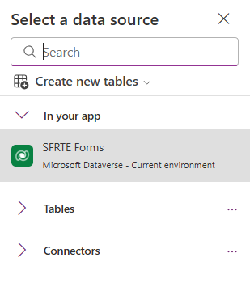

5. To integrate a Gallery with a Form, set the Form's `item` property in the PowerFx formula bar to `Gallery1.Selected`. This binds the Form to the item selected in Gallery1.

    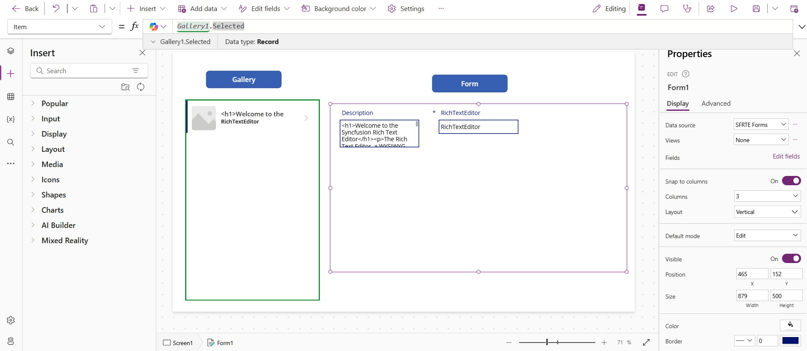

6. The output of the Vertical gallery and Edit form component will displayed. Customize the component properties in the right property pane and also via the PowerFx tab on top.

    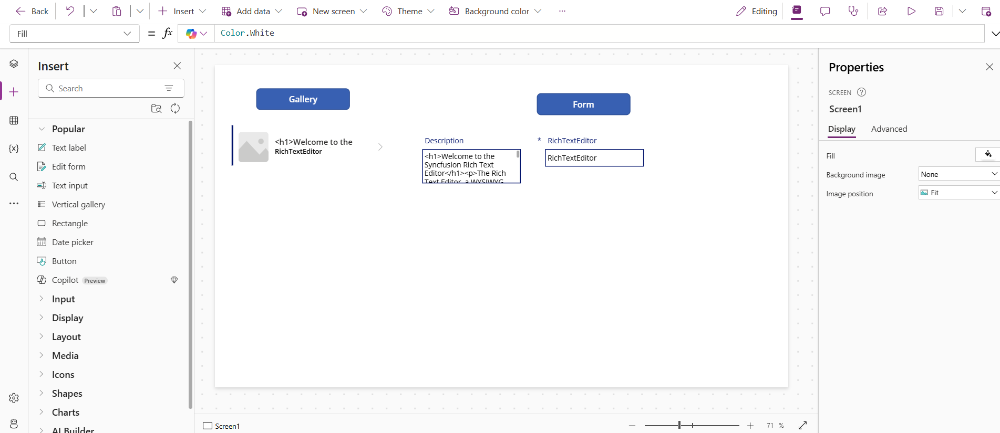

## Add Syncfusion PowerApps RichTextEditor code component into PowerApps Form

Enhance your canvas application by adding the Syncfusion PowerApps RichTextEditor code component using the following steps:

1. Integrating the Syncfusion PowerApps RichTextEditor code component into the canvas application by following docs [Import Syncfusion PowerApps RichTextEditor code component into canvas application](./getting-started-with-canvas.md#import-syncfusion-powerapps-richtexteditor-code-component-into-canvas-application).

2. Unlock Status DatacardValue1 and then delete the highlighted datacard value control.

    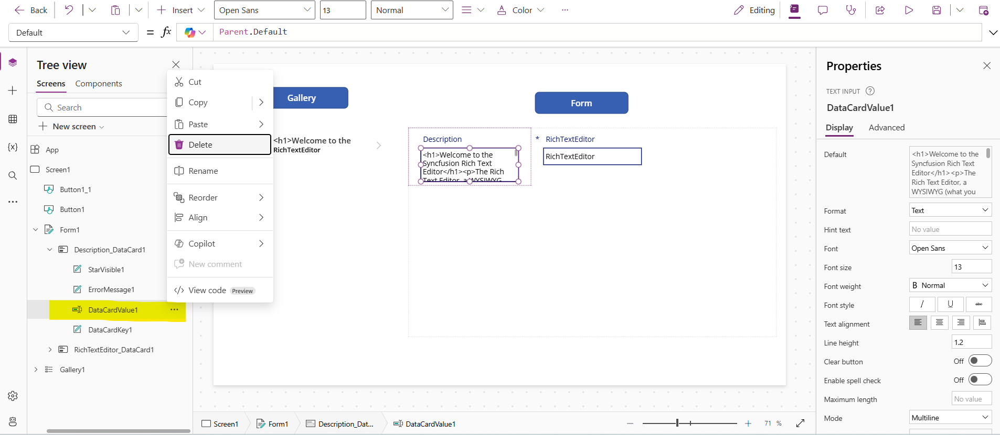

3. From the `Insert` tab on left pane, drag and drop the `SfRichTextEditor` component located in the `code components` section into the Description column of the Edit Form.

    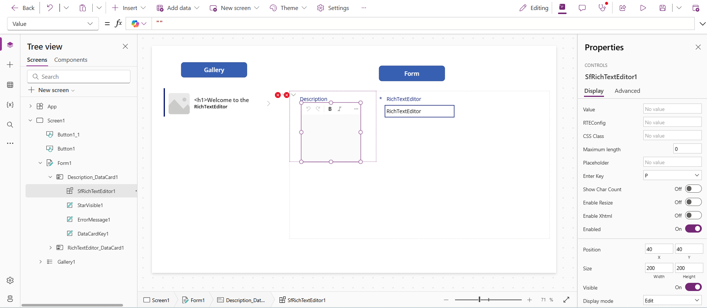

4. Set the `value` property of the RichTextEditor code component to `ThisItem.Description` to bind it to the Description column data.

    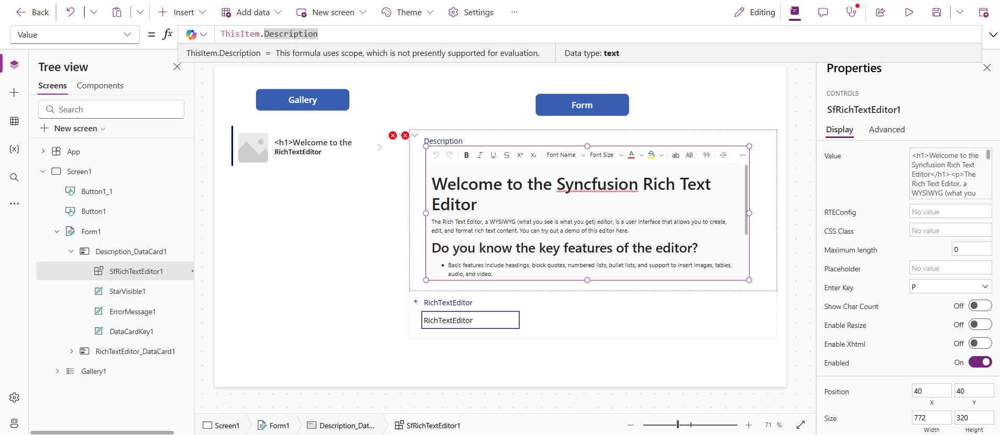

5. In the `Update` property of the Description column in the Edit Form, set it to `SfRichTextEditor1.Value` to save the editor’s content.

    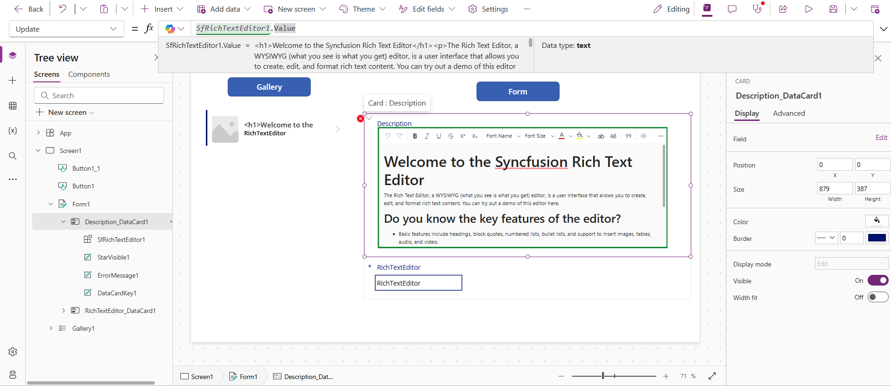

6. If issues persist in the Form, resolve them by clicking on the error, selecting the `Edit in the formula bar` option, and updating the correct properties for `SfRichTextEditor1.Y` and `SfRichTextEditor1.Height`.

    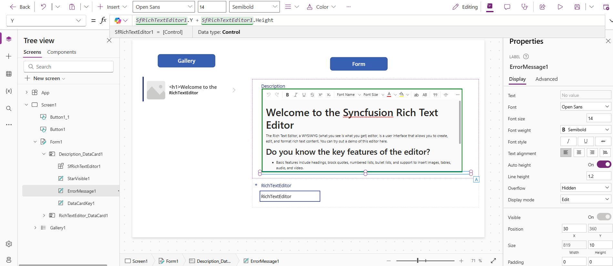

7. The output of the PowerApps RichTextEditor code component will display within the PowerApps Form. Customize the component properties using the right property pane or through the PowerFx tab at the top.

    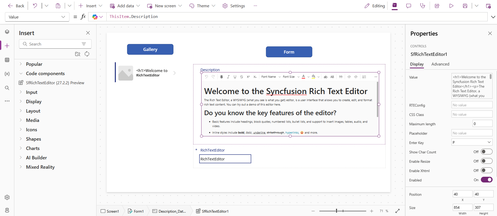

## Preview the Syncfusion RichTextEditor code component in PowerApps Form

To preview the Syncfusion PowerApps RichTextEditor application in development environment with multiple device resolution, click the `Preview` button at the top right corner of the PowerApps portal.

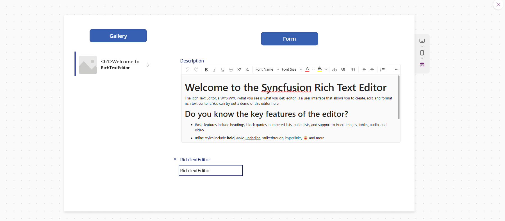

## Publish the Syncfusion RichTextEditor code component in PowerApps Form

To publish the Syncfusion PowerApps RichTextEditor application in the production environment, click the `Publish` button at the top right corner of the PowerApps portal. Now you can share the published application with your users.

Once the application is published, you can preview it by clicking the `play` button of the created canvas application from the `Apps` tab on the homepage.

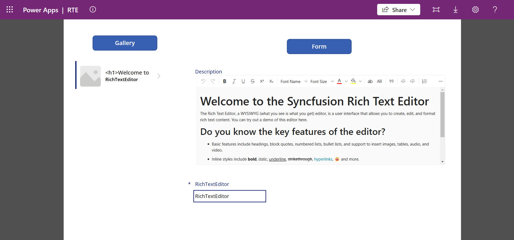

## See also

- [Getting Started with the Syncfusion PowerApps RichTextEditor Code Component in Canvas Application](getting-started-with-canvas.md)

- [Getting Started with the Syncfusion PowerApps RichTextEditor Code Component in Model-Driven Application (Form)](getting-started-with-model-driven-form.md)

- [Getting Started with the Syncfusion PowerApps RichTextEditor Code Component in Model-Driven Application (Custom Pages)](getting-started-with-model-driven-custom-pages.md)
