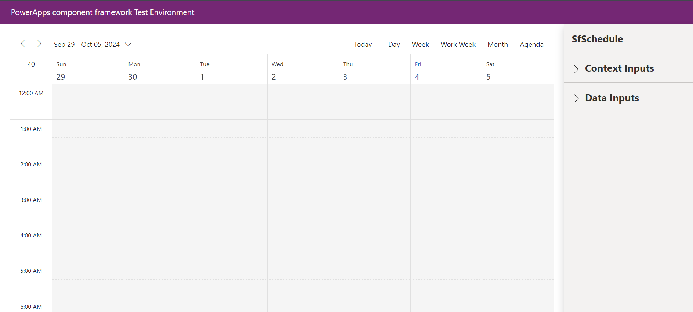
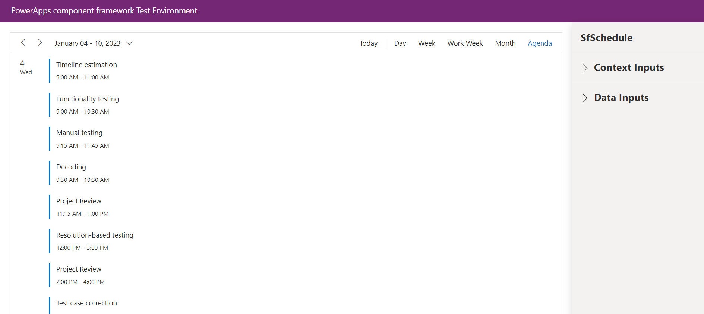

# Getting Started with Syncfusion Schedule Code Component in Local (TestHarness)

This article provides a step-by-step guide to run the Schedule code component sample in local (TestHarness).

## Prerequisites:

Before getting started with the Schedule code component, ensure the following prerequisites are satisfied:

- [node.js (>= v18.20.4)](https://nodejs.org/en/download/) (LTS version is recommended)
- [System requirements for Syncfusion React components](https://ej2.syncfusion.com/react/documentation/system-requirement)

## Rapid utilization of Schedule code component

To run the Syncfusion Schedule code component, follow these steps:

1. Ensure that all the prerequisites are met.

2. Open a command prompt (cmd) and navigate to the Schedule code component, which is located in the [components/schedule/](../../components/schedule/) folder.

3. Utilize the following command to install the Schedule code component and its dependent packages:

```bash
npm install
```

4. Execute the sample with the following command to visualize the Schedule code component:

```bash
npm start watch
```



5. First update the selectedDate property with `2023/01/04` and now, within the `Data Inputs` section of the property pane, designate the data source for the Schedule code component using the [**ScheduleData.csv**](../../components/schedule/data/scheduleData.csv) and optionally paste the [ScheduleConfig](../../components/schedule/data/scheduleConfig.json) JSON into the `ScheduleConfig` property as per the requirement.

> [!NOTE]
> After loading the data source, proceed to select the required column types in the DataSource section. For example, assign the `SingleLine.Text` column type for the `Subject` column of DataSource property.


6. After loading the CSV file, click the `Apply` button to load the data source in the Schedule code component.



7. Customize the Schedule code component properties in the right property pane.

> [!NOTE]
> Additionally, explore the [API documentation](./api.md) for comprehensive details on the properties, methods, and events of the Schedule code component.

## See also

- [Getting Started with the Syncfusion PowerApps Schedule Code Component in Canvas Application](getting-started-with-canvas.md)

- [Getting Started with the Syncfusion PowerApps Schedule Code Component in Model-Driven Application (Form)](getting-started-with-model-driven-form.md)

- [Getting Started with the Syncfusion PowerApps Schedule Code Component in Model-Driven Application (Custom Pages)](getting-started-with-model-driven-custom-pages.md)

- [Getting Started with the Syncfusion PowerApps Schedule Code Component in PowerPages](getting-started-with-power-pages.md)
