# Getting Started with Syncfusion Schedule Code Component in Power Pages Application

This article provides a step-by-step guide for setting up a Power pages application and integrating the Syncfusion Schedule code component.

Power Pages is a low-code platform in the Microsoft Power Platform family, designed for creating secure and responsive external-facing business websites. It facilitates rapid development without extensive coding, integrates with data sources, and inherits robust security features from Microsoft Azure, making it a versatile tool for diverse website needs.

## Prerequisites

- [Published Syncfusion PowerApps solution package](../../README.md#deploying-the-solution-package-in-the-powerapps-portal)

## Create a new Dataverse table

Syncfusion PowerApps Schedule code component requires data to be loaded from a data source. Follow the steps provided in the [Create a new Dataverse table](../common/faq.md#how-to-create-a-new-dataverse-table) section to create a new table in Dataverse using the CSV in the Schedule sample [data](../../components/schedule/data/) folder. Skip this step if you have an existing table with data.

When creating the Dataverse table using [CSV](../../components/schedule/data/scheduleData.csv) file, ensure the column names and data types match those in the table below:

| Column Name | DataType   |
|-------------|------------|
| Id          | Whole.none |
| Subject     | SingleLine.Text |
| StartTime   | Date and Time |
| EndTime     | Date and Time |
| IsAllDay    | Yes/no |
| ProjectId   | Whole.none |
| TaskId      | Whole.none |

> [!NOTE]
> When setting up a Dataverse, make sure that the table columns are assigned the correct data types to prevent data loading issues in the Schedule code component.

## Add Syncfusion PowerApps Schedule code component to the Dataverse table

To integrate the Syncfusion PowerApps Schedule code component to the Dataverse table, follow the steps below:

1. In the Dataverse table, navigate to the `Forms` tab in the Data experiences pane to streamline data management. Locate the `Information` form with the **main** form type, which defines how users interact with and organize data effectively.

2. Within the left navigation pane of the `Information` form, locate the `Components` tab. Here, click on `Get more components` at the bottom of the tab.

5. A window will appear. Switch to the `Build by others` tab at the top and import the built code component named `SfSchedule` from the published solutions.

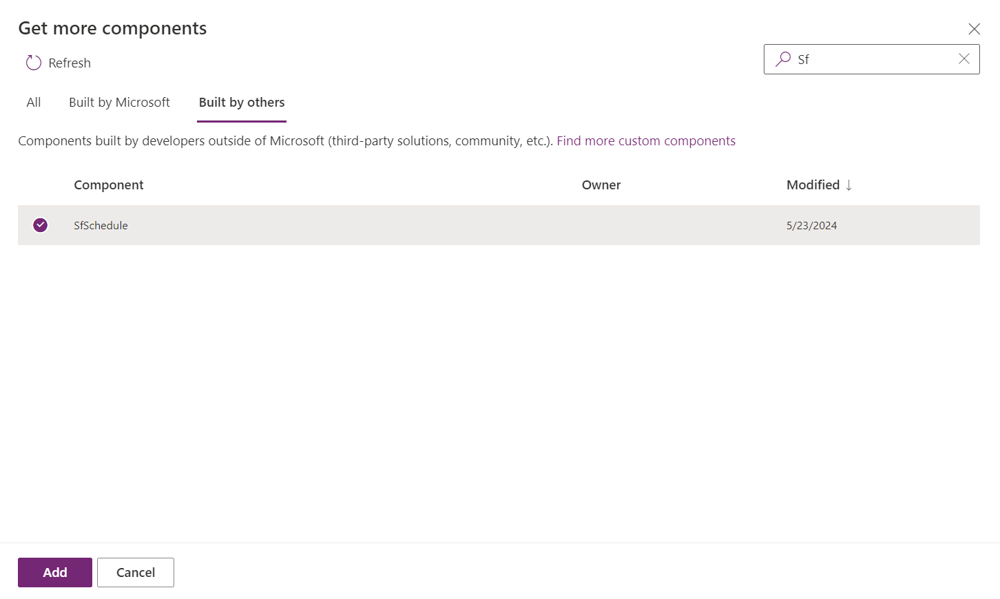

6. Create a new section in the form, choosing for a `1-column tab` from the `popular` section. Rename this tab as **Schedule View** to clearly delineate its purpose. This tab will be utilized to render the Schedule code component.

7. In the `More Components` section, choose the `SfSchedule` component. Connect the Schedule code component to your Dataverse tables to ensure smooth data integration. We can also use the optional [ScheduleConfig](../../components/schedule/data/scheduleConfig.json) JSON configuration to configure the Schedule code component. Also, customize other properties as needed.

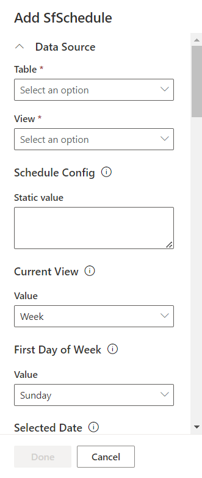

8. The output of the Schedule code component will be displayed as shown below after updating `selected date` property with `2023/01/04`. Then click the `Save and publish` button at the top right corner of the PowerApps portal. This action commits the changes made to the form, ensuring that the Syncfusion PowerApps Schedule code component is now an integral part of the Dataverse table.

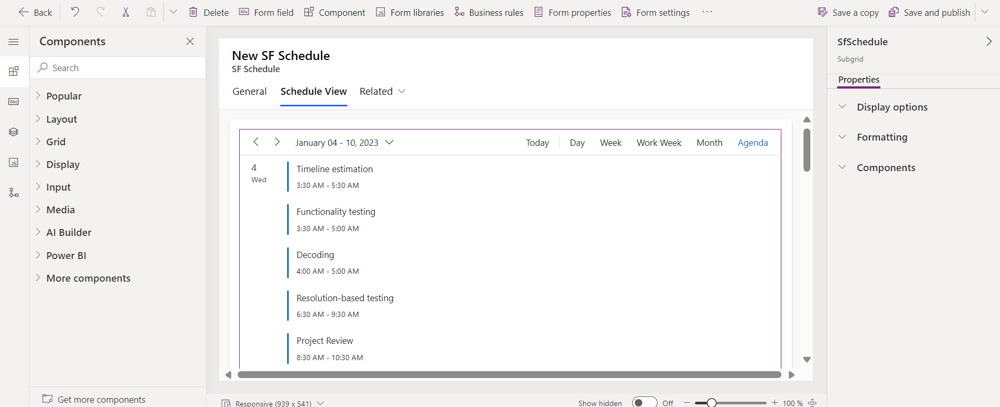

## Create a Power Pages application

To create a Power Pages application, follow the steps below:

1. In the [Power pages portal](https://make.powerpages.microsoft.com/), click the `Start from blank` option to create a new Power Pages application. And provide a meaningful name for your Power Pages application. Subsequently, click `create` to proceed.

2. The Power Pages platform will generate a blank Power Pages application based on your specifications. You are now ready to start building your application. The created application will be listed in `Active sites` tab. Now. click `Edit` the application to proceed.

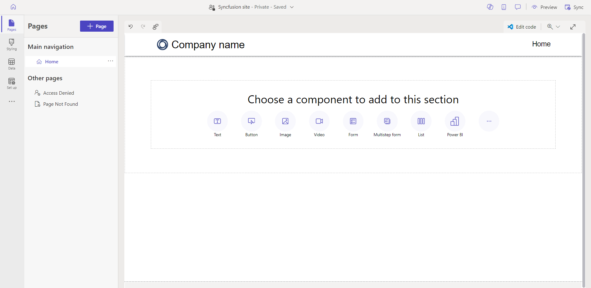

3. Then update the header title and logo by clicking the `Edit site header` button in the header section. And change the theme of the application to `Moss` in the `Theme` section. Finally, click the `Save` button to save the changes.

4. Add new section by clicking the `ADD A SECTION` button. And create a heading by choosing `Text` component.

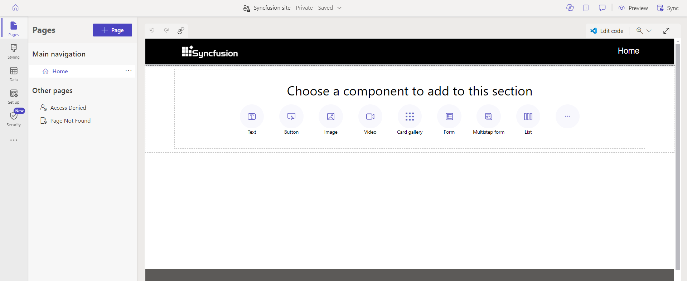

5. Now click the `Form` button under the title component to add the previously created table form contains Syncfusion Schedule code component. And choose the `New Form` option to select a new form. In that, select the previously created table and its form. Finally, click the `ok` button to save the changes.

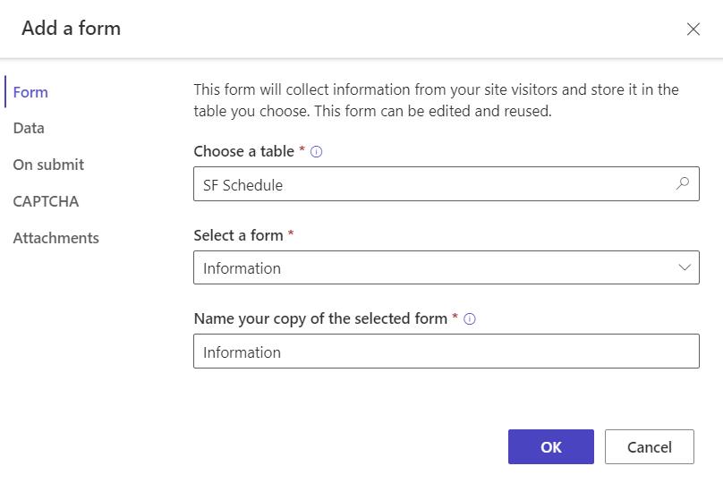

6. click the `New permission` button on top of the form to add the permission for the Dataverse table. And select the necessary permission for the table. Finally, click the `ok` button to save the changes.

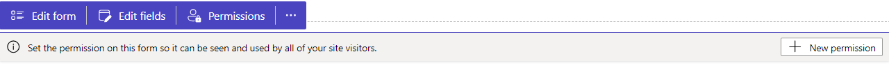

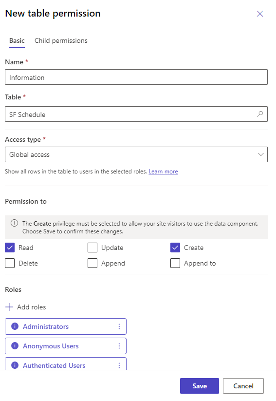

7. After updating the permission, click `Edit form` on the form component and select `data` tab on left pane. On that, click the `Open Portal Management app` button under configuration section to open the portal management app in new tab.

8. In the opened Portal Management app, click the `Basic Form Metadata` tab of the `Information` table form. and create **two** new form metadata by clicking the `New Basic Form Metadata` button. And provide the necessary details for the form metadata for `Schedule View` tab and the code component. Finally, click the `Save` button to save the changes. check below screenshots for reference.

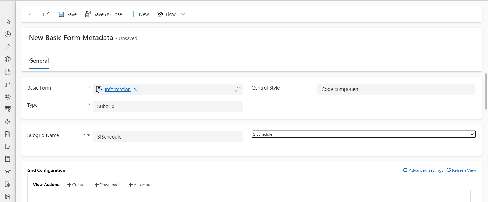

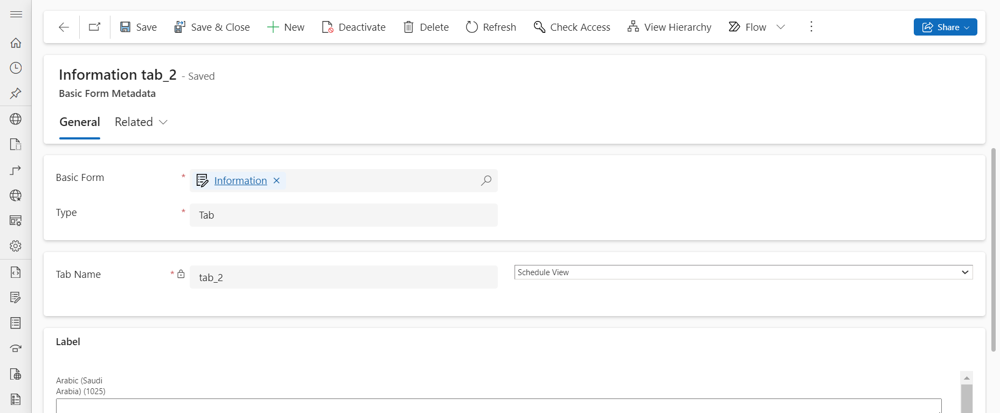

9. After updating the form metadata, navigate to the Power pages portal and click the `ok` button on the form component to save the changes. Finally, click the `Sync` on the top right corner of the Power pages application to synchronize the changes.

10. Now, click the `Preview` button on the top right corner of the Power pages application and click `Desktop` to preview the application in new tab. The output of the Schedule code component will appear as shown below.

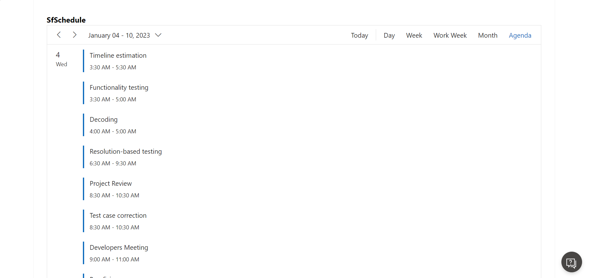

## See also

- [Getting Started with Syncfusion PowerApps Schedule Code Component in Canvas Application](getting-started-with-canvas.md)

- [Getting Started with Syncfusion PowerApps Schedule Code Component in Model Driven Application](getting-started-with-model-driven-form.md)

- [Getting Started with Syncfusion PowerApps Schedule Code Component in Model Driven Application (Custom Pages)](getting-started-with-model-driven-custom-pages.md)
