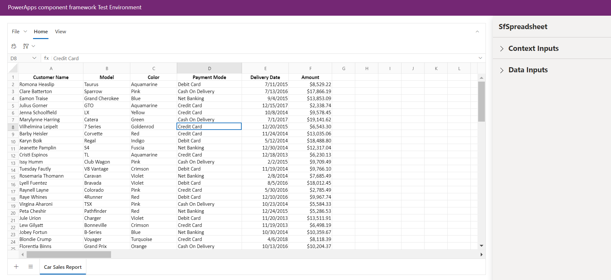
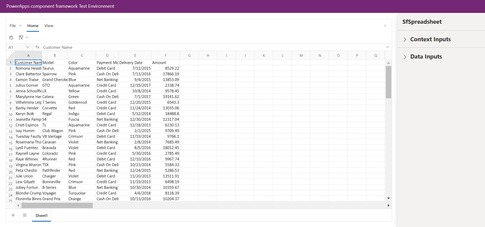

# Getting Started with Syncfusion Spreadsheet Code Component in Local (TestHarness)

This article provides a step-by-step guide to run the Syncfusion Spreadsheet code component in local (TestHarness).

## Prerequisites

Before getting started with the Syncfusion Spreadsheet code component, ensure the following prerequisites are satisfied:

- [node.js  (>= v18.20.4)](https://nodejs.org/en/download/) (LTS version is recommended)
- [System requirements for Syncfusion React components](https://ej2.syncfusion.com/react/documentation/system-requirement)

## Rapid utilization of Spreadsheet code component

To run the Syncfusion Spreadsheet code component, follow these steps:

1. Ensure that all the prerequisites are met.

2. Open a command prompt (cmd) and navigate to the Spreadsheet code component, which is located in the [components/spreadsheet/](../../components/spreadsheet/) folder.

3. Utilize the following command to install the dependent packages:

```bash
npm install
```

4. Execute the sample with the following command to visualize the Spreadsheet code component:

```bash
npm start watch
```



5. Additionally you want to define dataSource (Json-based data) within the `Data Inputs` section of the property pane, designate the data source for the Spreadsheet code component using the [**spreadsheetData.csv**](../../components/spreadsheet/data/spreadsheetData.csv).

> [!NOTE]
> After loading the data source, proceed to select the required column types of DataSource section in the property pane. For example, assign the `SingleLine.Text` column type for the `Customer Name` column of DataSource property.


6. After loading the CSV file, click the `Apply` button to load the data source in the Spreadsheet code component. 



7. Customize the Spreadsheet code component properties in the right property pane.

> [!NOTE]
> Additionally, explore the [API documentation](./api.md) for comprehensive details on the properties, methods, and events of the Spreadsheet code component.

## See also

- [Getting Started with the Syncfusion PowerApps Spreadsheet Code Component in Canvas Application](getting-started-with-canvas.md)

- [Getting Started with the Syncfusion PowerApps Spreadsheet Code Component in Model-Driven Application (Custom Pages)](getting-started-with-model-driven-custom-pages.md)
